# 1-Overview

# Overview
Relevant source files
- [index.html](https://github.com/rhythm162k/First-Cost/blob/5752f3ac/index.html)
- [package.json](https://github.com/rhythm162k/First-Cost/blob/5752f3ac/package.json)
- [source/js/controller.js](https://github.com/rhythm162k/First-Cost/blob/5752f3ac/source/js/controller.js)

First Cost is a client-side personal finance diary application designed to help users track their income, expenses, and savings. It provides a simple interface for adding transactions, viewing financial summaries, and visualizing data through charts. The application is entirely client-side, meaning all user data is stored locally in the browser's `localStorage`.

The application follows a Model-View-Controller (MVC) architectural pattern, separating concerns into distinct components. The Model (`model.js`) manages the application's state and business logic, the Views (classes in `source/js/views/`) are responsible for rendering the UI, and the Controller (`source/js/controller.js`) mediates interactions between the Model and Views.

The core technologies used include Parcel for bundling, Chart.js for data visualization, and `localStorage` for data persistence.

For detailed instructions on setting up and running the project, see [Getting Started](/rhythm162k/First-Cost/1.1-getting-started). To understand the application's structure and how its components interact, refer to [Application Architecture](/rhythm162k/First-Cost/1.2-application-architecture).

## Application Purpose and Scope

First Cost serves as a personal financial management tool, allowing users to record their financial transactions and gain insights into their spending and saving habits. It's a single-page application (SPA) that operates entirely within the user's browser. The primary goal is to offer a straightforward and private way to manage personal finances without relying on server-side infrastructure.

The application's scope is limited to individual financial tracking. It does not include features like multi-user support, cloud synchronization, or integration with external financial services. All data is stored locally, ensuring user privacy and control over their financial information.

## Architectural Overview (MVC)

First Cost implements the Model-View-Controller (MVC) architectural pattern to organize its codebase. This pattern promotes a clear separation of concerns, making the application more modular, maintainable, and scalable.

### Model

The Model, primarily implemented in `source/js/model.js`[source/js/model.js1-139](https://github.com/rhythm162k/First-Cost/blob/5752f3ac/source/js/model.js#L1-L139) is responsible for managing the application's data and business logic. This includes:

- Storing the application's state, such as user accounts and transactions.
- Performing calculations, like balance, income, expense, and savings.
- Handling data persistence to and retrieval from `localStorage`.
- Implementing authentication and registration logic.

### View

The View layer consists of various view classes located in the `source/js/views/` directory. Each view class is responsible for a specific part of the user interface. Their primary responsibilities include:

- Rendering HTML elements based on the current application state.
- Updating the UI in response to changes in the Model.
- Attaching event listeners to UI elements to capture user input.

Examples of view classes include `dashboardView.js`[source/js/controller.js2](https://github.com/rhythm162k/First-Cost/blob/5752f3ac/source/js/controller.js#L2-L2)`transactionView.js`[source/js/controller.js3](https://github.com/rhythm162k/First-Cost/blob/5752f3ac/source/js/controller.js#L3-L3) and `chartView.js`[source/js/controller.js9](https://github.com/rhythm162k/First-Cost/blob/5752f3ac/source/js/controller.js#L9-L9) For more details, see [View Layer](/rhythm162k/First-Cost/3-view-layer).

### Controller

The Controller, implemented in `source/js/controller.js`[source/js/controller.js1-174](https://github.com/rhythm162k/First-Cost/blob/5752f3ac/source/js/controller.js#L1-L174) acts as the intermediary between the Model and the Views. Its main functions are:

- Receiving user input events from the Views.
- Processing these events, often by calling methods on the Model to update the application state.
- Updating the Views to reflect changes in the Model.
- Bootstrapping the application by initializing components and registering event handlers. The `init()` function [source/js/controller.js152-174](https://github.com/rhythm162k/First-Cost/blob/5752f3ac/source/js/controller.js#L152-L174) is the entry point for this process.

The following diagram illustrates the high-level MVC flow:

```

```

Sources: [source/js/controller.js1-174](https://github.com/rhythm162k/First-Cost/blob/5752f3ac/source/js/controller.js#L1-L174)[source/js/model.js1-139](https://github.com/rhythm162k/First-Cost/blob/5752f3ac/source/js/model.js#L1-L139)

For a deeper dive into the application's architecture, including the `init()` bootstrapping process and handler registration, see [Application Architecture](/rhythm162k/First-Cost/1.2-application-architecture).

## Technology Stack

First Cost leverages a modern client-side technology stack to deliver its functionality.

### Parcel

Parcel is used as the web application bundler [package.json15](https://github.com/rhythm162k/First-Cost/blob/5752f3ac/package.json#L15-L15) It simplifies the development workflow by automatically handling asset compilation, module bundling, and hot module replacement. The `package.json` file defines scripts for starting a development server (`npm start`) [package.json9](https://github.com/rhythm162k/First-Cost/blob/5752f3ac/package.json#L9-L9) building for production (`npm run build`) [package.json10](https://github.com/rhythm162k/First-Cost/blob/5752f3ac/package.json#L10-L10) and deploying to GitHub Pages (`npm run deploy`) [package.json11](https://github.com/rhythm162k/First-Cost/blob/5752f3ac/package.json#L11-L11)

For more information on the build process, see [Parcel Build Pipeline](/rhythm162k/First-Cost/5.1-parcel-build-pipeline).

### Chart.js

Chart.js is a flexible JavaScript charting library used for visualizing financial data [package.json13](https://github.com/rhythm162k/First-Cost/blob/5752f3ac/package.json#L13-L13) It enables the application to display interactive pie charts for transaction summaries and line charts for monthly financial trends. The `chartView.js`[source/js/controller.js9](https://github.com/rhythm162k/First-Cost/blob/5752f3ac/source/js/controller.js#L9-L9) module in the View layer is responsible for integrating and rendering charts using Chart.js.

The `controlCharts` function in `source/js/controller.js`[source/js/controller.js82-131](https://github.com/rhythm162k/First-Cost/blob/5752f3ac/source/js/controller.js#L82-L131) prepares the data for Chart.js, calculating summaries and monthly breakdowns before passing them to `chartView.renderExpenseChart`[source/js/controller.js124](https://github.com/rhythm162k/First-Cost/blob/5752f3ac/source/js/controller.js#L124-L124) and `chartView.renderMonthlyChart`[source/js/controller.js125-130](https://github.com/rhythm162k/First-Cost/blob/5752f3ac/source/js/controller.js#L125-L130)

### localStorage

`localStorage` is the primary mechanism for client-side data persistence. All user accounts and their associated financial transactions are stored directly in the browser's `localStorage` under the key `"accounts"`[source/js/controller.js16](https://github.com/rhythm162k/First-Cost/blob/5752f3ac/source/js/controller.js#L16-L16) This approach ensures that user data remains private and accessible only on the device where it was created.

The `readingData` function [source/js/controller.js15-18](https://github.com/rhythm162k/First-Cost/blob/5752f3ac/source/js/controller.js#L15-L18) in the controller is responsible for retrieving this data when the application initializes, and the Model (`model.js`) handles saving updates to `localStorage`.

## Project Structure

The project is organized into several key directories:

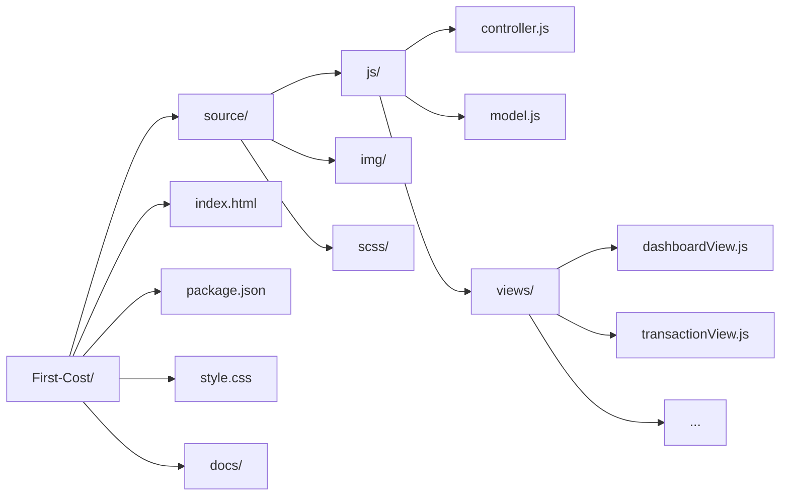
```mermaid
flowchart LR
    A["First-Cost/"]
    B["source/"]
    C["js/"]
    C1["controller.js"]
    C2["model.js"]
    C3["views/"]
    C3_1["dashboardView.js"]
    C3_2["transactionView.js"]
    C3_3["..."]
    D["img/"]
    E["scss/"]
    F["index.html"]
    G["package.json"]
    H["style.css"]
    I["docs/"]
    A --> B
    B --> C
    C --> C1
    C --> C2
    C --> C3
    C3 --> C3_1
    C3 --> C3_2
    C3 --> C3_3
    B --> D
    B --> E
    A --> F
    A --> G
    A --> H
    A --> I
```

Sources: [package.json1-17](https://github.com/rhythm162k/First-Cost/blob/5752f3ac/package.json#L1-L17)[index.html1-12](https://github.com/rhythm162k/First-Cost/blob/5752f3ac/index.html#L1-L12)[source/js/controller.js1-11](https://github.com/rhythm162k/First-Cost/blob/5752f3ac/source/js/controller.js#L1-L11)

- `source/`: Contains the main application source code.

- `js/`: JavaScript modules.

- `controller.js`: The main application controller.
- `model.js`: The application's data model and business logic.
- `views/`: Directory containing individual view classes (e.g., `dashboardView.js`, `transactionView.js`).
- `img/`: Image assets used in the application.
- `scss/`: SCSS files for styling, which are compiled into `style.css`.
- `index.html`: The main HTML file, serving as the entry point for the application.
- `package.json`: Defines project metadata, scripts, and dependencies.
- `style.css`: The compiled stylesheet.
- `docs/`: The output directory for the production build, typically used for GitHub Pages deployment.

For a detailed breakdown of the repository layout and dependencies, see [Getting Started](/rhythm162k/First-Cost/1.1-getting-started).

## Child Pages

This page provides a high-level overview. For more in-depth information on specific aspects of the First Cost application, please refer to the following child pages:

- **[Getting Started](/rhythm162k/First-Cost/1.1-getting-started)**: Covers installation, `npm` scripts, repository layout, `.gitignore` configuration, and project dependencies.
- **[Application Architecture](/rhythm162k/First-Cost/1.2-application-architecture)**: Explains the MVC flow in detail, including the `controller.js` mediation between model and views, the `init()` bootstrapping process, and event handler registration.

---

# 1.1-Getting-Started

# Getting Started
Relevant source files
- [.gitignore](https://github.com/rhythm162k/First-Cost/blob/5752f3ac/.gitignore)
- [package-lock.json](https://github.com/rhythm162k/First-Cost/blob/5752f3ac/package-lock.json)
- [package.json](https://github.com/rhythm162k/First-Cost/blob/5752f3ac/package.json)
- [source/img/logo-dark.png](https://github.com/rhythm162k/First-Cost/blob/5752f3ac/source/img/logo-dark.png)

This page provides detailed technical information for installing and running the **First Cost** application, outlines the npm scripts available for development and deployment workflows, explains the repository layout and important configuration files, and describes core dependencies. It serves as the initial entry point for developers who want to build, run, or contribute to First Cost.

---

## 1. Installation and Setup

**First Cost** is a client-side personal finance diary app, requiring Node.js and npm for local development.

To install dependencies, run:

```
npm install
```

This reads the `package.json` manifest and installs all listed dependencies into `node_modules/`.

---

## 2. npm Scripts

There are three main npm scripts configured in `package.json`:

| Script | Command | Description |
| --- | --- | --- |
| `start` | `parcel index.html` | Starts the app in development mode using Parcel bundler with hot reloading. Runs on a local server. |
| `build` | `parcel build index.html --public-url ./` | Bundles optimized production assets into the `dist/` folder, with relative paths handled for deployment. |
| `deploy` | `rm -rf dist docs && npm run build && cp -R dist docs` | Cleans previous artifacts, runs a production build, copies `dist/` to `docs/` for GitHub Pages hosting. |

- The `start` script launches a local Parcel dev server serving the SPA.
- The `build` script produces a bundled, minified version suitable for deployment.
- The `deploy` script prepares the output for GitHub Pages by copying `dist` to `docs`.

These scripts enable efficient development, production build, and deployment cycles.

---

## 3. Repository Layout

The repository is organized with a clear separation of concerns:

```
/
├── index.html            # SPA shell with hooks and markup for modals, nav, and main panels
├── package.json          # npm manifest describing dependencies and scripts
├── package-lock.json     # npm lockfile ensuring consistent installs
├── .gitignore            # Specifies files/folders excluded from Git version control
├── source/               # Source code directory
│   ├── js/               # JavaScript source for MVC components
│   │   ├── model.js      # Model layer - state and domain logic 
│   │   ├── views.js      # Base views class with helpers for marking rendering and delegation
│   │   ├── transactionsView.js  # Transaction list and deletion handling
│   │   ├── filterTransactionView.js # UI for filtering transactions
│   │   ├── dashboardView.js  # Dashboard metrics and chart integration
│   │   ├── chartView.js      # Chart.js wrapper for pie and line charts
│   │   ├── loginView.js      # Login UI and authentication handlers
│   │   ├── registerView.js   # Registration modal and validation
│   │   ├── deleteAccView.js  # Account deletion modal controls
│   │   ├── sidebarView.js    # Sidebar overlay and menu toggling
│   │   ├── navigationView.js # Navigation anchor scrolling behavior
│   │   └── themeView.js      # Theme toggle and synchronization with charts
│   └── img/              # Static image assets such as logos and icons
│       └── logo-dark.png # Dark theme logo asset
└── dist/                 # Build output (generated by Parcel)
└── docs/                 # Deployment folder for GitHub Pages (copy of dist)
```

- The `source/js/` directory contains MVC components: model, views, and controllers.
- Static assets like logos reside in `source/img/`.
- The `dist/` and `docs/` folders are generated build artifacts not committed to the repo.

---

## 4. .gitignore

The `.gitignore` present ensures that generated files and dependencies are excluded from version control:

```
.parcel-cache
dist
node_modules

```

- `.parcel-cache` stores Parcel's internal cache files.
- `dist` is the build output folder.
- `node_modules` is the dependency installation folder.

This prevents cluttering the repo with large or transient data.

---

## 5. Dependencies

Key dependencies listed in `package.json` underpin the app's functionality:

| Dependency | Version | Purpose |
| --- | --- | --- |
| `parcel` | ^2.16.4 | Zero-config bundler facilitating development and builds. |
| `chart.js` | ^4.5.1 | Renders interactive pie and line charts in the dashboard. |

These dependencies are installed during `npm install` and provide:

- **Parcel:** Serves, bundles, and optimizes the SPA codebase.
- **Chart.js:** Visualizes transaction data graphically.

---

## 6. Data Flow and Key Code Entities

The app follows an MVC architecture, where:

- **Model** (`model.js`) handles application state, persistence via localStorage, and business domain logic.
- **View classes** in `source/js/` handle UI rendering, event handling, and user interaction.
- **Controller logic** coordinates between model and views (not explicitly separated into a dedicated controller file but embedded in view event handlers and initialization).

Basic flow during startup and runtime:

1. `init()` bootstraps the app: setting up initial state and registering UI handlers.
2. User interactions trigger view event handlers.
3. Views call model methods to mutate or fetch state (e.g., add transaction, login).
4. Updated state triggers UI re-renders and dashboard updates including charts.

---

## 7. Mermaid Diagrams

### 7.1 System Overview to Code Entities Mapping

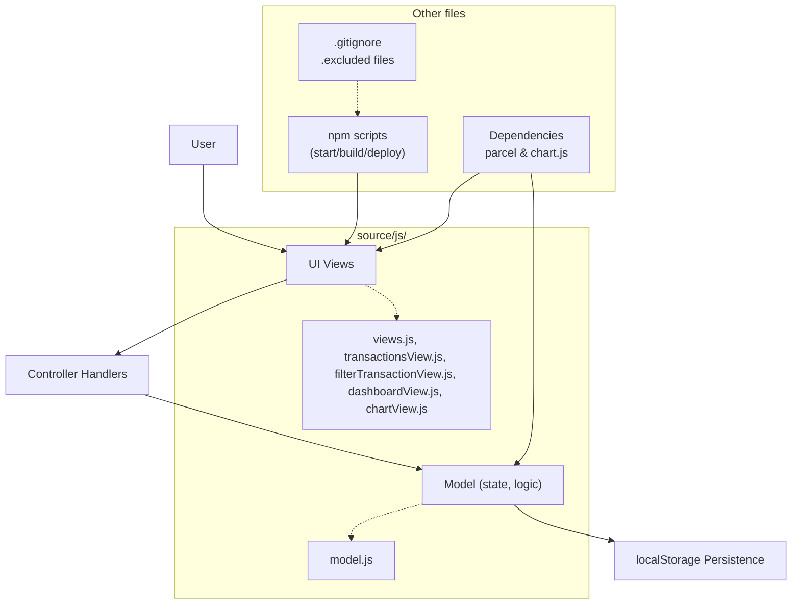
```mermaid
flowchart TD
    A["User"]
    C["Controller Handlers"]
    E["localStorage Persistence"]
    subgraph subGraph1 ["Other files"]
        NPM["npm scripts<br>(start/build/deploy)"]
        GIT[".gitignore<br>.excluded files"]
        DEP["Dependencies<br>parcel & chart.js"]
    end
    subgraph source_js_ ["source/js/"]
        B["UI Views"]
        D["Model (state, logic)"]
        V["views.js, transactionsView.js, filterTransactionView.js, dashboardView.js, chartView.js"]
        M["model.js"]
    end
    A --> B
    B --> C
    C --> D
    D --> E
    B -.-> V
    D -.-> M
    NPM --> B
    GIT -.-> NPM
    DEP --> B
    DEP --> D
```

This diagram shows the real entities in the codebase that correspond to the major functional blocks of the system: Users interact with UI Views which rely on Controller logic to update the Model, which persists data using localStorage. The `npm` scripts manage starting and building the app, and dependencies enable the core capabilities.

---

### 7.2 npm Scripts to Deployment Artifacts

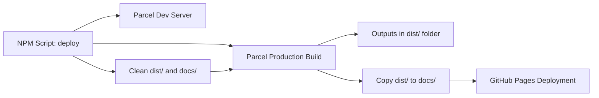
```mermaid
flowchart LR
    A["NPM Script: deploy"]
    B["Parcel Dev Server"]
    C["Parcel Production Build"]
    D["Outputs in dist/ folder"]
    E["Clean dist/ and docs/"]
    F["Copy dist/ to docs/"]
    G["GitHub Pages Deployment"]
    A --> B
    A --> C
    C --> D
    A --> E
    E --> C
    C --> F
    F --> G
```

This clarifies how each npm script operates to start development, produce a build, and deploy the app by copying build artifacts appropriately.

---

## Summary

- **Install:** Run `npm install` to acquire dependencies.
- **Run:** Use `npm start` to host locally with Parcel and develop interactively.
- **Build:** Use `npm build` for optimized production bundles.
- **Deploy:** Use `npm deploy` to prepare and copy files for GitHub Pages hosting.
- **Repo Structure:** Keeps code, assets, and build artifacts cleanly separated.
- **.gitignore:** Prevents generated and installed files from polluting version control.
- **Dependencies:** Parcel for bundling and Chart.js for chart visualization.
- **Architecture:** MVC pattern with clear flow of data and control between UI, state, and persistence layers.

---

### Sources:

- `package.json:2-17`()
- `.gitignore:1-3`()
- `package-lock.json:1-193`() (for dependency details)
- `source/img/logo-dark.png` (confirms asset layout)

---

# 1.2-Application-Architecture

# Application Architecture
Relevant source files
- [source/js/controller.js](https://github.com/rhythm162k/First-Cost/blob/5752f3ac/source/js/controller.js)
- [source/js/views/views.js](https://github.com/rhythm162k/First-Cost/blob/5752f3ac/source/js/views/views.js)

This page details the Model-View-Controller (MVC) architecture implemented in First Cost. It explains how the controller mediates interactions between the model (data and business logic) and the views (user interface), focusing on the application's bootstrapping process (`init()`) and event handler registration.

## MVC Overview

First Cost follows an MVC architectural pattern to separate concerns, making the codebase more organized and maintainable.

- **Model**: Manages the application's data, state, and business logic. It is responsible for data persistence (via `localStorage`), transaction management, account operations, and theme control. The model is primarily implemented in `source/js/model.js`.
- **View**: Responsible for displaying the data to the user and handling user input. Views are typically stateless and react to changes in the model. They are located in the `source/js/views/` directory.
- **Controller**: Acts as an intermediary between the Model and View. It receives user input from the views, processes it (often by interacting with the model), and then updates the views based on the model's state. The main controller logic resides in `source/js/controller.js`.

The following diagram illustrates the high-level MVC flow:

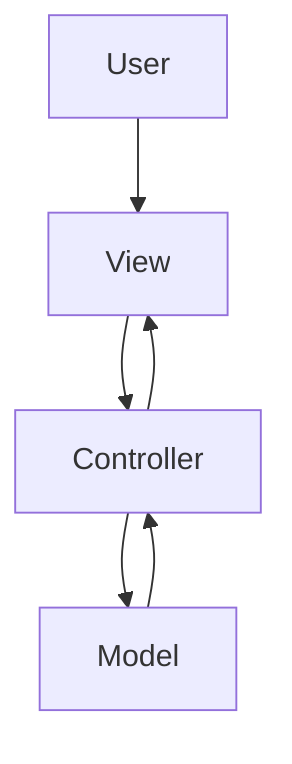
```mermaid
flowchart TD
    User["User"]
    View["View"]
    Controller["Controller"]
    Model["Model"]
    User --> View
    View --> Controller
    Controller --> Model
    Model --> Controller
    Controller --> View
```

Sources:
[source/js/controller.js1-12](https://github.com/rhythm162k/First-Cost/blob/5752f3ac/source/js/controller.js#L1-L12)[source/js/model.js1](https://github.com/rhythm162k/First-Cost/blob/5752f3ac/source/js/model.js#L1-L1)[source/js/views/dashboardView.js1](https://github.com/rhythm162k/First-Cost/blob/5752f3ac/source/js/views/dashboardView.js#L1-L1)[source/js/views/transactionView.js1](https://github.com/rhythm162k/First-Cost/blob/5752f3ac/source/js/views/transactionView.js#L1-L1)[source/js/views/sidebarView.js1](https://github.com/rhythm162k/First-Cost/blob/5752f3ac/source/js/views/sidebarView.js#L1-L1)[source/js/views/navigationView.js1](https://github.com/rhythm162k/First-Cost/blob/5752f3ac/source/js/views/navigationView.js#L1-L1)[source/js/views/loginView.js1](https://github.com/rhythm162k/First-Cost/blob/5752f3ac/source/js/views/loginView.js#L1-L1)[source/js/views/registerView.js1](https://github.com/rhythm162k/First-Cost/blob/5752f3ac/source/js/views/registerView.js#L1-L1)[source/js/views/filterTransaction.js1](https://github.com/rhythm162k/First-Cost/blob/5752f3ac/source/js/views/filterTransaction.js#L1-L1)[source/js/views/chartView.js1](https://github.com/rhythm162k/First-Cost/blob/5752f3ac/source/js/views/chartView.js#L1-L1)[source/js/views/themeView.js1](https://github.com/rhythm162k/First-Cost/blob/5752f3ac/source/js/views/themeView.js#L1-L1)[source/js/views/deleteAccView.js1](https://github.com/rhythm162k/First-Cost/blob/5752f3ac/source/js/views/deleteAccView.js#L1-L1)

## Controller Implementation

The `source/js/controller.js` file is the central hub for application logic, orchestrating interactions between different parts of the application. It imports all necessary model functions and view classes [source/js/controller.js1-11](https://github.com/rhythm162k/First-Cost/blob/5752f3ac/source/js/controller.js#L1-L11)

### Bootstrapping (`init()`)

The application's lifecycle begins with the `init()` function [source/js/controller.js152-174](https://github.com/rhythm162k/First-Cost/blob/5752f3ac/source/js/controller.js#L152-L174) This function is called once when the application loads and is responsible for:

1. **Reading Initial Data**: It calls `readingData()`[source/js/controller.js153](https://github.com/rhythm162k/First-Cost/blob/5752f3ac/source/js/controller.js#L153-L153) which retrieves account data from `localStorage` and initializes the model's state using `model.init()`[source/js/controller.js15-18](https://github.com/rhythm162k/First-Cost/blob/5752f3ac/source/js/controller.js#L15-L18)
2. **Registering Event Handlers**: It registers various event handlers from different view modules, passing controller functions as callbacks. This allows views to communicate user actions back to the controller without directly knowing about the model.

The following diagram illustrates the `init()` process and handler registration:

```

```

Sources:
[source/js/controller.js15-18](https://github.com/rhythm162k/First-Cost/blob/5752f3ac/source/js/controller.js#L15-L18)[source/js/controller.js152-174](https://github.com/rhythm162k/First-Cost/blob/5752f3ac/source/js/controller.js#L152-L174)

### Key Controller Functions and Data Flow

The controller contains several functions that handle specific user interactions and update the model and views accordingly.

- **`controlDashboardAndTransaction()`**: Updates the dashboard metrics (balance, expense, income, savings) and renders the transaction list. This function is called after any action that modifies transactions or account balance [source/js/controller.js20-30](https://github.com/rhythm162k/First-Cost/blob/5752f3ac/source/js/controller.js#L20-L30)
- **Input**: None (relies on `model.state`).
- **Output**: Updates `dashboard` and `transactionView`.
- **Calls**: `dashboard.updateBalance()`, `dashboard.updateExpense()`, `dashboard.updateIncome()`, `dashboard.updateSavings()`, `dashboard.updateUserName()`, `transactionView.render()`.
- **`controlFormData(data)`**: Handles user login. It calls `model.userData()` to validate credentials, then updates the UI (theme, dashboard, charts) and logs the user in via `loginView.logHandler()`[source/js/controller.js37-46](https://github.com/rhythm162k/First-Cost/blob/5752f3ac/source/js/controller.js#L37-L46)
- **Input**: `data` (user credentials).
- **Output**: Updates `model.state`, `themeView`, `dashboard`, `chartView`, `loginView`.
- **Calls**: `model.userData()`, `crntTheme()`, `controlDashboardAndTransaction()`, `controlCharts()`, `loginView.logHandler()`, `loginView.errorHandler()`.
- **`controlRegistration(data)`**: Manages new user registration. It calls `model.newRegistration()` and then closes the registration modal [source/js/controller.js49-56](https://github.com/rhythm162k/First-Cost/blob/5752f3ac/source/js/controller.js#L49-L56)
- **Input**: `data` (new user details).
- **Output**: Updates `model.state`, `registerView`.
- **Calls**: `model.newRegistration()`, `registerView.modalHandler()`, `registerView.errorHandler()`.
- **`controlNewTransaction(data)`**: Adds a new transaction. It calls `model.newTransaction()`, then updates the dashboard and charts, and finally toggles the transaction form [source/js/controller.js58-63](https://github.com/rhythm162k/First-Cost/blob/5752f3ac/source/js/controller.js#L58-L63)
- **Input**: `data` (new transaction details).
- **Output**: Updates `model.state`, `dashboard`, `chartView`, `transactionView`.
- **Calls**: `model.newTransaction()`, `controlDashboardAndTransaction()`, `controlCharts()`, `transactionView.toggleTransactionForm()`.
- **`controlDeleteTxn(id)`**: Deletes a transaction by its ID. It calls `model.deleteTranx()`, then updates the dashboard and charts [source/js/controller.js65-69](https://github.com/rhythm162k/First-Cost/blob/5752f3ac/source/js/controller.js#L65-L69)
- **Input**: `id` (transaction ID).
- **Output**: Updates `model.state`, `dashboard`, `chartView`.
- **Calls**: `model.deleteTranx()`, `controlDashboardAndTransaction()`, `controlCharts()`.
- **`controlFilter(data)`**: Filters transactions based on criteria. It calls `model.filterTRX()` and renders the filtered transactions [source/js/controller.js71-75](https://github.com/rhythm162k/First-Cost/blob/5752f3ac/source/js/controller.js#L71-L75)
- **Input**: `data` (filter criteria).
- **Output**: Updates `transactionView`.
- **Calls**: `model.filterTRX()`, `transactionView.render()`.
- **`controlCharts()`**: Prepares data for and renders the pie and line charts. It aggregates transaction data into `summary` and `monthly` objects before passing them to `chartView`[source/js/controller.js82-131](https://github.com/rhythm162k/First-Cost/blob/5752f3ac/source/js/controller.js#L82-L131)
- **Input**: None (relies on `model.state.transaction`).
- **Output**: Updates `chartView`.
- **Calls**: `chartView.statsState()`, `chartView.renderExpenseChart()`, `chartView.renderMonthlyChart()`.
- **`controlTheme(theme)`**: Changes the application theme. It calls `model.themeControl()` to update the model's theme and then `chartView.updateColors()` to ensure charts reflect the new theme [source/js/controller.js138-141](https://github.com/rhythm162k/First-Cost/blob/5752f3ac/source/js/controller.js#L138-L141)
- **Input**: `theme` (e.g., 'dark', 'light').
- **Output**: Updates `model.state`, `chartView`.
- **Calls**: `model.themeControl()`, `chartView.updateColors()`.
- **`controlDeleteFrom(data)`**: Handles account deletion. It calls `model.deleteAcc()` and then redirects the user to the starting page [source/js/controller.js143-150](https://github.com/rhythm162k/First-Cost/blob/5752f3ac/source/js/controller.js#L143-L150)
- **Input**: `data` (account deletion confirmation).
- **Output**: Updates `model.state`, `deleteAccView`.
- **Calls**: `model.deleteAcc()`, `deleteAccView.backToStart()`, `deleteAccView.errorHandler()`.

The `Views` base class (`source/js/views/views.js`) provides common functionalities for all views, such as `formHandler()` for processing form submissions [source/js/views/views.js2-14](https://github.com/rhythm162k/First-Cost/blob/5752f3ac/source/js/views/views.js#L2-L14) and `errorHandler()` for displaying error messages [source/js/views/views.js31-38](https://github.com/rhythm162k/First-Cost/blob/5752f3ac/source/js/views/views.js#L31-L38)

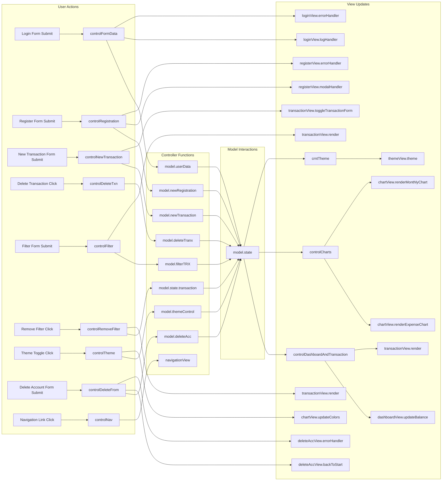
```mermaid
flowchart LR
    subgraph subGraph3 ["View Updates"]
        U1["controlDashboardAndTransaction"]
        U2["controlCharts"]
        U3["crntTheme"]
        V1["dashboardView.updateBalance"]
        V2["transactionView.render"]
        V3["chartView.renderExpenseChart"]
        V4["chartView.renderMonthlyChart"]
        V5["themeView.theme"]
        V6["loginView.logHandler"]
        V7["loginView.errorHandler"]
        V8["registerView.modalHandler"]
        V10["registerView.errorHandler"]
        V11["transactionView.toggleTransactionForm"]
        V12["transactionView.render"]
        V13["transactionView.render"]
        V14["chartView.updateColors"]
        V15["deleteAccView.backToStart"]
        V16["deleteAccView.errorHandler"]
    end
    subgraph subGraph2 ["Model Interactions"]
        S["model.state"]
    end
    subgraph subGraph1 ["Controller Functions"]
        M1["model.userData"]
        M2["model.newRegistration"]
        M3["model.newTransaction"]
        M4["model.deleteTranx"]
        M5["model.filterTRX"]
        M6["model.state.transaction"]
        M7["model.themeControl"]
        M8["model.deleteAcc"]
        V9["navigationView"]
    end
    subgraph subGraph0 ["User Actions"]
        A["Login Form Submit"]
        C1["controlFormData"]
        B["Register Form Submit"]
        C2["controlRegistration"]
        C["New Transaction Form Submit"]
        C3["controlNewTransaction"]
        D["Delete Transaction Click"]
        C4["controlDeleteTxn"]
        E["Filter Form Submit"]
        C5["controlFilter"]
        F["Remove Filter Click"]
        C6["controlRemoveFilter"]
        G["Theme Toggle Click"]
        C7["controlTheme"]
        H["Delete Account Form Submit"]
        C8["controlDeleteFrom"]
        I["Navigation Link Click"]
        C9["controlNav"]
    end
    A --> C1
    B --> C2
    C --> C3
    D --> C4
    E --> C5
    F --> C6
    G --> C7
    H --> C8
    I --> C9
    C1 --> M1
    C2 --> M2
    C3 --> M3
    C4 --> M4
    C5 --> M5
    C6 --> M6
    C7 --> M7
    C8 --> M8
    C9 --> V9
    M1 --> S
    M2 --> S
    M3 --> S
    M4 --> S
    M5 --> S
    M6 --> S
    M7 --> S
    M8 --> S
    S --> U1
    S --> U2
    S --> U3
    U1 --> V1
    U1 --> V2
    U2 --> V3
    U2 --> V4
    U3 --> V5
    C1 --> V6
    C1 --> V7
    C2 --> V8
    C2 --> V10
    C3 --> V11
    C5 --> V12
    C6 --> V13
    C7 --> V14
    C8 --> V15
    C8 --> V16
```

Sources:
[source/js/controller.js20-30](https://github.com/rhythm162k/First-Cost/blob/5752f3ac/source/js/controller.js#L20-L30)[source/js/controller.js37-46](https://github.com/rhythm162k/First-Cost/blob/5752f3ac/source/js/controller.js#L37-L46)[source/js/controller.js49-56](https://github.com/rhythm162k/First-Cost/blob/5752f3ac/source/js/controller.js#L49-L56)[source/js/controller.js58-63](https://github.com/rhythm162k/First-Cost/blob/5752f3ac/source/js/controller.js#L58-L63)[source/js/controller.js65-69](https://github.com/rhythm162k/First-Cost/blob/5752f3ac/source/js/controller.js#L65-L69)[source/js/controller.js71-75](https://github.com/rhythm162k/First-Cost/blob/5752f3ac/source/js/controller.js#L71-L75)[source/js/controller.js82-131](https://github.com/rhythm162k/First-Cost/blob/5752f3ac/source/js/controller.js#L82-L131)[source/js/controller.js138-141](https://github.com/rhythm162k/First-Cost/blob/5752f3ac/source/js/controller.js#L138-L141)[source/js/controller.js143-150](https://github.com/rhythm162k/First-Cost/blob/5752f3ac/source/js/controller.js#L143-L150)[source/js/views/views.js2-14](https://github.com/rhythm162k/First-Cost/blob/5752f3ac/source/js/views/views.js#L2-L14)[source/js/views/views.js31-38](https://github.com/rhythm162k/First-Cost/blob/5752f3ac/source/js/views/views.js#L31-L38)

---

# 2-Data-Layer-(model.js)

# Data Layer (model.js)
Relevant source files
- [source/js/model.js](https://github.com/rhythm162k/First-Cost/blob/5752f3ac/source/js/model.js)

The data layer, primarily encapsulated within `source/js/model.js`[source/js/model.js1-139](https://github.com/rhythm162k/First-Cost/blob/5752f3ac/source/js/model.js#L1-L139) is responsible for managing the application's state, handling data persistence, and implementing core domain logic. This includes user authentication, transaction management, and financial calculations. It acts as the central source of truth for the application's data.

This page provides a high-level overview of the data layer's components and their interactions. Detailed explanations of specific functionalities are delegated to child pages.

## Core Components and Interactions

The `model.js` file defines the application's `state` object [source/js/model.js8-17](https://github.com/rhythm162k/First-Cost/blob/5752f3ac/source/js/model.js#L8-L17) functions for user authentication and registration, transaction management, and data persistence to `localStorage`. The `accounts` array [source/js/model.js1](https://github.com/rhythm162k/First-Cost/blob/5752f3ac/source/js/model.js#L1-L1) holds all registered user data, while `crntUser`[source/js/model.js2](https://github.com/rhythm162k/First-Cost/blob/5752f3ac/source/js/model.js#L2-L2) stores the currently logged-in user's information.

The following diagram illustrates the main components and their relationships within the data layer:

### Data Layer Overview

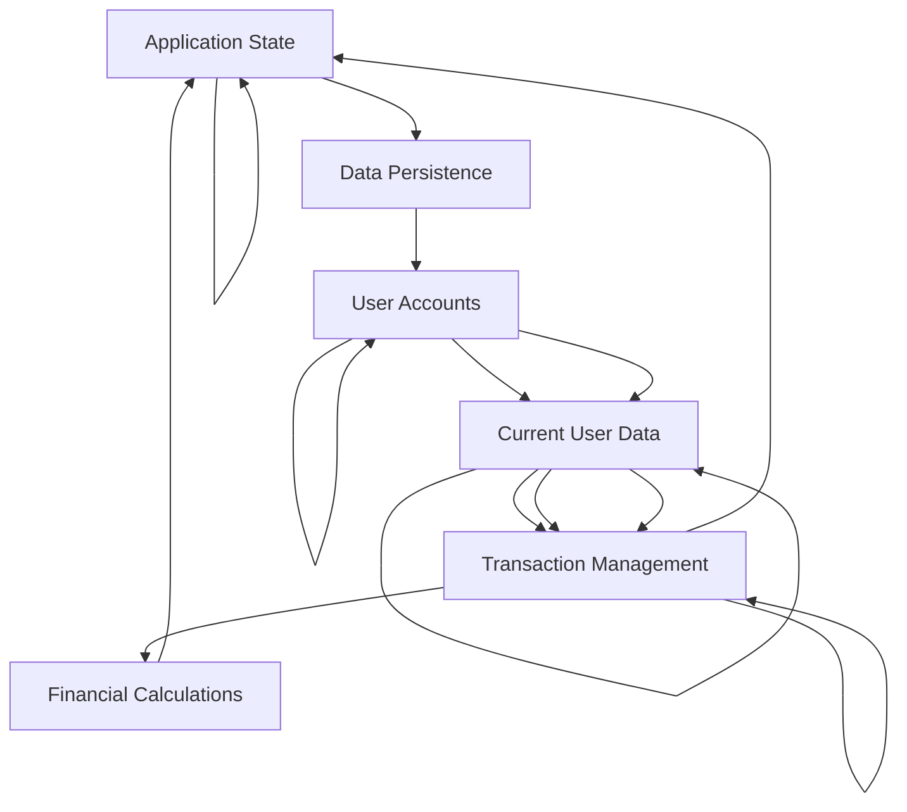
```mermaid
flowchart TD
    A["Application State"]
    B["Data Persistence"]
    C["User Accounts"]
    D["Current User Data"]
    E["Transaction Management"]
    F["Financial Calculations"]
    A --> B
    B --> C
    C --> D
    D --> E
    E --> F
    F --> A
    C --> D
    D --> E
    D --> E
    E --> A
    C --> C
    D --> D
    A --> A
    E --> E
```

Sources: [source/js/model.js1-139](https://github.com/rhythm162k/First-Cost/blob/5752f3ac/source/js/model.js#L1-L139)

## State and Transactions

The `state` object [source/js/model.js8-17](https://github.com/rhythm162k/First-Cost/blob/5752f3ac/source/js/model.js#L8-L17) holds the current user's financial summary, including `fullName`, `name`, `transaction` list, `theme`, `balace`, `income`, `expense`, and `savings`. Functions like `newTransaction`[source/js/model.js56-69](https://github.com/rhythm162k/First-Cost/blob/5752f3ac/source/js/model.js#L56-L69) and `deleteTranx`[source/js/model.js71-79](https://github.com/rhythm162k/First-Cost/blob/5752f3ac/source/js/model.js#L71-L79) modify the `crntUser.transactions` array and trigger updates to the `state` object. The `setInit`[source/js/model.js134-139](https://github.com/rhythm162k/First-Cost/blob/5752f3ac/source/js/model.js#L134-L139) function resets the financial summary in `state`, and `updateState`[source/js/model.js117-132](https://github.com/rhythm162k/First-Cost/blob/5752f3ac/source/js/model.js#L117-L132) recalculates `income`, `expense`, `savings`, and `balace` based on the current transactions. Transaction filtering is handled by `filterTRX`[source/js/model.js91-110](https://github.com/rhythm162k/First-Cost/blob/5752f3ac/source/js/model.js#L91-L110)

For details on how the application state is managed and transactions are handled, see [State and Transactions](/rhythm162k/First-Cost/2.1-state-and-transactions).

Sources: [source/js/model.js8-17](https://github.com/rhythm162k/First-Cost/blob/5752f3ac/source/js/model.js#L8-L17)[source/js/model.js56-69](https://github.com/rhythm162k/First-Cost/blob/5752f3ac/source/js/model.js#L56-L69)[source/js/model.js71-79](https://github.com/rhythm162k/First-Cost/blob/5752f3ac/source/js/model.js#L71-L79)[source/js/model.js134-139](https://github.com/rhythm162k/First-Cost/blob/5752f3ac/source/js/model.js#L134-L139)[source/js/model.js117-132](https://github.com/rhythm162k/First-Cost/blob/5752f3ac/source/js/model.js#L117-L132)[source/js/model.js91-110](https://github.com/rhythm162k/First-Cost/blob/5752f3ac/source/js/model.js#L91-L110)

## Accounts, Auth and Persistence

User accounts are stored in the `accounts` array [source/js/model.js1](https://github.com/rhythm162k/First-Cost/blob/5752f3ac/source/js/model.js#L1-L1) and persisted in `localStorage` under the key `'accounts'`[source/js/model.js50](https://github.com/rhythm162k/First-Cost/blob/5752f3ac/source/js/model.js#L50-L50) The `userData` function [source/js/model.js19-34](https://github.com/rhythm162k/First-Cost/blob/5752f3ac/source/js/model.js#L19-L34) handles user login validation, setting the `crntUser`[source/js/model.js2](https://github.com/rhythm162k/First-Cost/blob/5752f3ac/source/js/model.js#L2-L2) and initializing the `state` for the logged-in user. New user registrations are managed by `newRegistration`[source/js/model.js36-54](https://github.com/rhythm162k/First-Cost/blob/5752f3ac/source/js/model.js#L36-L54) while `deleteAcc`[source/js/model.js81-89](https://github.com/rhythm162k/First-Cost/blob/5752f3ac/source/js/model.js#L81-L89) allows users to remove their accounts. The `themeControl` function [source/js/model.js112-115](https://github.com/rhythm162k/First-Cost/blob/5752f3ac/source/js/model.js#L112-L115) updates the user's preferred theme and persists it.

### User Authentication and Persistence Flow

```

```

Sources: [source/js/model.js1](https://github.com/rhythm162k/First-Cost/blob/5752f3ac/source/js/model.js#L1-L1)[source/js/model.js50](https://github.com/rhythm162k/First-Cost/blob/5752f3ac/source/js/model.js#L50-L50)[source/js/model.js19-34](https://github.com/rhythm162k/First-Cost/blob/5752f3ac/source/js/model.js#L19-L34)[source/js/model.js2](https://github.com/rhythm162k/First-Cost/blob/5752f3ac/source/js/model.js#L2-L2)[source/js/model.js36-54](https://github.com/rhythm162k/First-Cost/blob/5752f3ac/source/js/model.js#L36-L54)[source/js/model.js81-89](https://github.com/rhythm162k/First-Cost/blob/5752f3ac/source/js/model.js#L81-L89)[source/js/model.js112-115](https://github.com/rhythm162k/First-Cost/blob/5752f3ac/source/js/model.js#L112-L115)

For a detailed explanation of user authentication, registration, account management, and data persistence, see [Accounts, Auth and Persistence](/rhythm162k/First-Cost/2.2-accounts-auth-and-persistence).

---

# 2.1-State-and-Transactions

# State and Transactions
Relevant source files
- [source/js/model.js](https://github.com/rhythm162k/First-Cost/blob/5752f3ac/source/js/model.js)

This page details the core data structures and logic within `model.js`[source/js/model.js](https://github.com/rhythm162k/First-Cost/blob/5752f3ac/source/js/model.js) focusing on the application's state management and transaction-related operations. It covers the `state` object, functions for creating and deleting transactions (`newTransaction`, `deleteTranx`), the aggregation of financial data (`setInit`, `updateState`), balance computation, and transaction filtering (`filterTRX`).

## The `state` Object

The `state` object [source/js/model.js8-17](https://github.com/rhythm162k/First-Cost/blob/5752f3ac/source/js/model.js#L8-L17) holds the current user's financial data and personal information. It is a central repository for the application's dynamic data.

```
export const state = {
  fullName: "",
  name: "",
  transaction: [],
  theme: "",
  balace: 0,
  income: 0,
  expense: 0,
  savings: 0,
};
```

The properties of the `state` object are:

- `fullName`: The full name of the currently logged-in user.
- `name`: The username of the currently logged-in user.
- `transaction`: An array containing all transaction objects for the current user.
- `theme`: The user's preferred theme (e.g., dark/light).
- `balace`: The calculated total balance (income - expense - savings).
- `income`: The total sum of all 'income' type transactions.
- `expense`: The total sum of all 'expense' type transactions.
- `savings`: The total sum of all 'savings' type transactions.

Sources:

- [source/js/model.js8-17](https://github.com/rhythm162k/First-Cost/blob/5752f3ac/source/js/model.js#L8-L17)

## Transaction Management

The application provides functionalities to add and remove transactions, which directly impact the user's financial state.

### `newTransaction`

The `newTransaction` function [source/js/model.js56-69](https://github.com/rhythm162k/First-Cost/blob/5752f3ac/source/js/model.js#L56-L69) creates a new transaction object and adds it to the `crntUser.transactions` array. It then persists the updated `accounts` data to `localStorage` and recalculates the financial state.

**Parameters:**

- `data` (Object): An object containing transaction details:

- `date` (String): The date of the transaction.
- `category` (String): The category of the transaction.
- `amount` (Number): The amount of the transaction.
- `type` (String): The type of transaction (e.g., "income", "expense", "savings").
- `description` (String): A brief description of the transaction.

**Process Flow:**

1. A unique `id` is generated for the new transaction [source/js/model.js58](https://github.com/rhythm162k/First-Cost/blob/5752f3ac/source/js/model.js#L58-L58)
2. The new transaction object (`newTxn`) is constructed [source/js/model.js57-64](https://github.com/rhythm162k/First-Cost/blob/5752f3ac/source/js/model.js#L57-L64)
3. `newTxn` is added to the beginning of the `crntUser.transactions` array using `unshift()`[source/js/model.js65](https://github.com/rhythm162k/First-Cost/blob/5752f3ac/source/js/model.js#L65-L65)
4. The entire `accounts` array, which now includes the updated `crntUser` with the new transaction, is saved to `localStorage`[source/js/model.js66](https://github.com/rhythm162k/First-Cost/blob/5752f3ac/source/js/model.js#L66-L66)
5. `setInit()`[source/js/model.js67](https://github.com/rhythm162k/First-Cost/blob/5752f3ac/source/js/model.js#L67-L67) is called to reset the `state`'s financial aggregates.
6. `updateState()`[source/js/model.js68](https://github.com/rhythm162k/First-Cost/blob/5752f3ac/source/js/model.js#L68-L68) is called to re-calculate `balace`, `income`, `expense`, and `savings` based on the current user's transactions.

### `deleteTranx`

The `deleteTranx` function [source/js/model.js71-79](https://github.com/rhythm162k/First-Cost/blob/5752f3ac/source/js/model.js#L71-L79) removes a transaction from the `crntUser.transactions` array based on its `id`. Similar to `newTransaction`, it updates `localStorage` and recalculates the financial state.

**Parameters:**

- `id` (Number): The unique identifier of the transaction to be deleted.

**Process Flow:**

1. The `findIndex()` method is used to locate the index of the transaction with the matching `id` within `crntUser.transactions`[source/js/model.js72-74](https://github.com/rhythm162k/First-Cost/blob/5752f3ac/source/js/model.js#L72-L74)
2. `splice()` is used to remove the transaction at the found index [source/js/model.js71-75](https://github.com/rhythm162k/First-Cost/blob/5752f3ac/source/js/model.js#L71-L75)
3. The updated `accounts` array is saved to `localStorage`[source/js/model.js76](https://github.com/rhythm162k/First-Cost/blob/5752f3ac/source/js/model.js#L76-L76)
4. `setInit()`[source/js/model.js77](https://github.com/rhythm162k/First-Cost/blob/5752f3ac/source/js/model.js#L77-L77) is called to reset the `state`'s financial aggregates.
5. `updateState()`[source/js/model.js78](https://github.com/rhythm162k/First-Cost/blob/5752f3ac/source/js/model.js#L78-L78) is called to re-calculate `balace`, `income`, `expense`, and `savings`.

### Transaction Management Flow

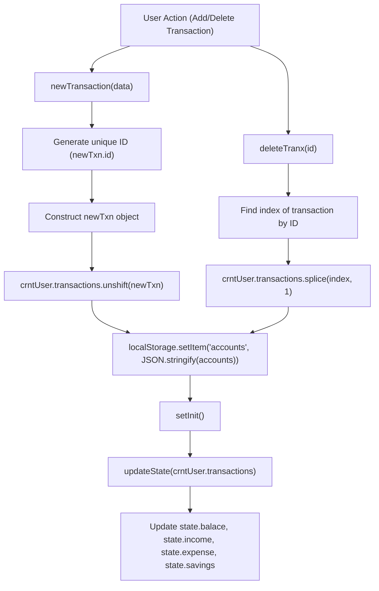
```mermaid
flowchart TD
    A["User Action (Add/Delete Transaction)"]
    B["newTransaction(data)"]
    C["deleteTranx(id)"]
    D["Generate unique ID (newTxn.id)"]
    E["Construct newTxn object"]
    F["crntUser.transactions.unshift(newTxn)"]
    G["localStorage.setItem('accounts', JSON.stringify(accounts))"]
    H["setInit()"]
    I["updateState(crntUser.transactions)"]
    J["Find index of transaction by ID"]
    K["crntUser.transactions.splice(index, 1)"]
    L["Update state.balace, state.income, state.expense, state.savings"]
    A --> B
    A --> C
    B --> D
    D --> E
    E --> F
    F --> G
    G --> H
    H --> I
    C --> J
    J --> K
    K --> G
    I --> L
```

Sources:

- [source/js/model.js56-69](https://github.com/rhythm162k/First-Cost/blob/5752f3ac/source/js/model.js#L56-L69)
- [source/js/model.js71-79](https://github.com/rhythm162k/First-Cost/blob/5752f3ac/source/js/model.js#L71-L79)

## State Aggregation and Balance Computation

The `setInit` and `updateState` functions work together to manage the aggregated financial data within the `state` object.

### `setInit`

The `setInit` function [source/js/model.js134-139](https://github.com/rhythm162k/First-Cost/blob/5752f3ac/source/js/model.js#L134-L139) is responsible for resetting the financial aggregation properties of the `state` object to zero. This is crucial before recalculating these values to ensure accuracy.

```
const setInit = function () {
  state.balace = 0;
  state.income = 0;
  state.expense = 0;
  state.savings = 0;
};
```

### `updateState`

The `updateState` function [source/js/model.js117-132](https://github.com/rhythm162k/First-Cost/blob/5752f3ac/source/js/model.js#L117-L132) takes an array of transactions and populates the `state.transaction` array, then calculates the total `income`, `expense`, `savings`, and `balace`.

**Parameters:**

- `transactions` (Array): An array of transaction objects for the current user.

**Process Flow:**

1. The `state.transaction` array is set to the provided `transactions` array [source/js/model.js118](https://github.com/rhythm162k/First-Cost/blob/5752f3ac/source/js/model.js#L118-L118)
2. `state.income` is calculated by filtering transactions of `type === "income"`, mapping their `amount`, and reducing them to a sum [source/js/model.js119-122](https://github.com/rhythm162k/First-Cost/blob/5752f3ac/source/js/model.js#L119-L122)
3. `state.expense` is calculated similarly for `type === "expense"`[source/js/model.js123-126](https://github.com/rhythm162k/First-Cost/blob/5752f3ac/source/js/model.js#L123-L126)
4. `state.savings` is calculated similarly for `type === "savings"`[source/js/model.js127-130](https://github.com/rhythm162k/First-Cost/blob/5752f3ac/source/js/model.js#L127-L130)
5. `state.balace` is computed as `state.income - state.expense - state.savings`[source/js/model.js131](https://github.com/rhythm162k/First-Cost/blob/5752f3ac/source/js/model.js#L131-L131)

### State Aggregation Flow

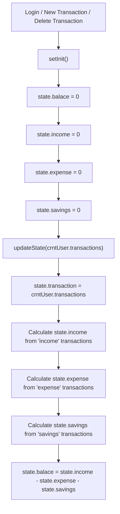
```mermaid
flowchart TD
    A["Login / New Transaction / Delete Transaction"]
    B["setInit()"]
    C["state.balace = 0"]
    D["state.income = 0"]
    E["state.expense = 0"]
    F["state.savings = 0"]
    G["updateState(crntUser.transactions)"]
    H["state.transaction = crntUser.transactions"]
    I["Calculate state.income from 'income' transactions"]
    J["Calculate state.expense from 'expense' transactions"]
    K["Calculate state.savings from 'savings' transactions"]
    L["state.balace = state.income - state.expense - state.savings"]
    A --> B
    B --> C
    C --> D
    D --> E
    E --> F
    F --> G
    G --> H
    H --> I
    I --> J
    J --> K
    K --> L
```

Sources:

- [source/js/model.js117-132](https://github.com/rhythm162k/First-Cost/blob/5752f3ac/source/js/model.js#L117-L132)
- [source/js/model.js134-139](https://github.com/rhythm162k/First-Cost/blob/5752f3ac/source/js/model.js#L134-L139)

## Transaction Filtering (`filterTRX`)

The `filterTRX` function [source/js/model.js91-110](https://github.com/rhythm162k/First-Cost/blob/5752f3ac/source/js/model.js#L91-L110) allows users to filter the `state.transaction` array based on various criteria such as category, date, and type.

**Parameters:**

- `data` (Object): An object containing filter criteria:

- `category` (String, optional): A string to match against transaction categories.
- `date` (String, optional): A specific date to match against transaction dates.
- `type` (String, optional): A specific transaction type (e.g., "income", "expense", "savings").

**Return Value:**

- `filteredTRX` (Array): An array of transaction objects that match the provided filter criteria.

**Process Flow:**

1. The function uses the `filter()` method on `state.transaction`[source/js/model.js92](https://github.com/rhythm162k/First-Cost/blob/5752f3ac/source/js/model.js#L92-L92)
2. For each transaction, it checks three conditions:

- `categoryMatch`: True if `data.category` is empty or the transaction's category (case-insensitive, trimmed) includes `data.category` (case-insensitive, trimmed) [source/js/model.js93-98](https://github.com/rhythm162k/First-Cost/blob/5752f3ac/source/js/model.js#L93-L98)
- `dateMatch`: True if `data.date` is empty or the transaction's date exactly matches `data.date`[source/js/model.js100](https://github.com/rhythm162k/First-Cost/blob/5752f3ac/source/js/model.js#L100-L100)
- `typeMatch`: True if `data.type` is empty or the transaction's type (case-insensitive, trimmed) exactly matches `data.type` (case-insensitive, trimmed) [source/js/model.js102-105](https://github.com/rhythm162k/First-Cost/blob/5752f3ac/source/js/model.js#L102-L105)
3. A transaction is included in `filteredTRX` only if all specified match conditions are true [source/js/model.js107](https://github.com/rhythm162k/First-Cost/blob/5752f3ac/source/js/model.js#L107-L107)

### `filterTRX` Logic

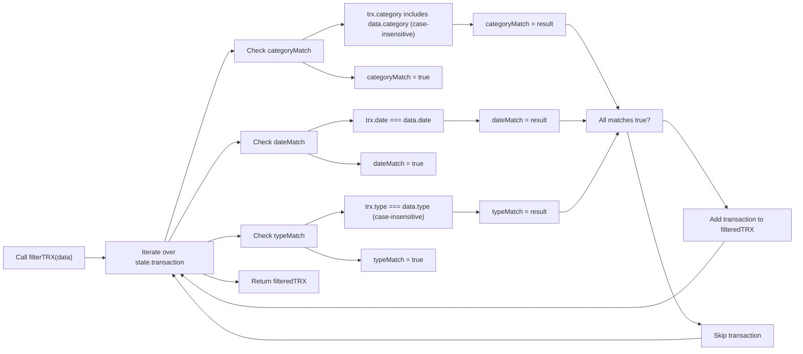
```mermaid
flowchart LR
    A["Call filterTRX(data)"]
    B["Iterate over state.transaction"]
    C["Check categoryMatch"]
    D["trx.category includes data.category (case-insensitive)"]
    E["categoryMatch = true"]
    F["categoryMatch = result"]
    G["Check dateMatch"]
    H["trx.date === data.date"]
    I["dateMatch = true"]
    J["dateMatch = result"]
    K["Check typeMatch"]
    L["trx.type === data.type (case-insensitive)"]
    M["typeMatch = true"]
    N["typeMatch = result"]
    O["All matches true?"]
    P["Add transaction to filteredTRX"]
    Q["Skip transaction"]
    R["Return filteredTRX"]
    A --> B
    B --> C
    C --> D
    C --> E
    D --> F
    B --> G
    G --> H
    G --> I
    H --> J
    B --> K
    K --> L
    K --> M
    L --> N
    F --> O
    J --> O
    N --> O
    O --> P
    O --> Q
    P --> B
    Q --> B
    B --> R
```

Sources:

- [source/js/model.js91-110](https://github.com/rhythm162k/First-Cost/blob/5752f3ac/source/js/model.js#L91-L110)

---

# 2.2-Accounts,-Auth-and-Persistence

# Accounts, Auth and Persistence
Relevant source files
- [source/js/model.js](https://github.com/rhythm162k/First-Cost/blob/5752f3ac/source/js/model.js)
- [source/js/views/loginView.js](https://github.com/rhythm162k/First-Cost/blob/5752f3ac/source/js/views/loginView.js)

## Purpose and Scope

This section details the account management, authentication, user registration, account deletion, theme control, and persistence logic implemented in `source/js/model.js` and `source/js/views/loginView.js`. The application relies entirely on client-side state and browser `localStorage` under the key `"accounts"` to persist user profiles, passwords, preferences, and transaction lists without a remote backend.

Sources: [source/js/model.js1-139](https://github.com/rhythm162k/First-Cost/blob/5752f3ac/source/js/model.js#L1-L139)[source/js/views/loginView.js1-25](https://github.com/rhythm162k/First-Cost/blob/5752f3ac/source/js/views/loginView.js#L1-L25)

---

## State and Account Management (`model.js`)

The persistence layer maintains an in-memory `accounts` array and a `crntUser` reference [source/js/model.js:1-2]. The global `state` object stores active user attributes, financial aggregates, and theme choices [source/js/model.js:8-17].

- `init(data)`: Initializes the module-scoped `accounts` collection with provided data or an empty array [source/js/model.js:4-6].
- `state`: Holds active session variables including `fullName`, `name`, `transaction`, `theme`, `balace`, `income`, `expense`, and `savings` [source/js/model.js:8-17].

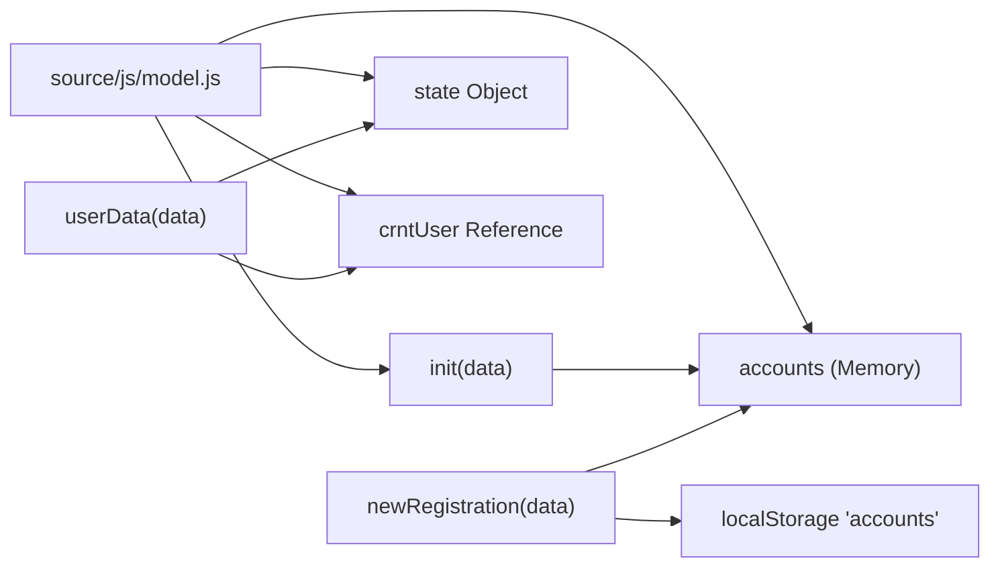
```mermaid
flowchart LR
    sub:Model["source/js/model.js"]
    init["init(data)"]
    state["state Object"]
    accounts["accounts (Memory)"]
    crntUser["crntUser Reference"]
    userData["userData(data)"]
    newRegistration["newRegistration(data)"]
    Storage["localStorage 'accounts'"]
    sub:Model --> init
    sub:Model --> state
    sub:Model --> accounts
    sub:Model --> crntUser
    init --> accounts
    userData --> crntUser
    userData --> state
    newRegistration --> accounts
    newRegistration --> Storage
```

Sources: [source/js/model.js1-17](https://github.com/rhythm162k/First-Cost/blob/5752f3ac/source/js/model.js#L1-L17)[source/js/model.js4-6](https://github.com/rhythm162k/First-Cost/blob/5752f3ac/source/js/model.js#L4-L6)

---

## Authentication and Registration Flow

User authentication and creation logic validates credentials against the in-memory `accounts` list and synchronizes changes to `localStorage`.

### Login Validation (`userData`)

The `userData(data)` function accepts a payload containing `username` and `password` [source/js/model.js:19-21]. It searches the `accounts` array for a matching username [source/js/model.js:22], throws an error if not found or if the password does not match [source/js/model.js:23-25], and populates the `state` object before initializing financial totals [source/js/model.js:26-30].

### New Account Registration (`newRegistration`)

The `newRegistration(data)` function ensures unique usernames and matching password confirmations [source/js/model.js:38-41]. It instantiates a new account record with empty transactions and themes, pushes it to `accounts`, and serializes the array into `localStorage` under the `"accounts"` key [source/js/model.js:42-50].

### Account Deletion (`deleteAcc`)

The `deleteAcc(data)` function verifies the active user's password, splices the user out of the `accounts` array, and updates `localStorage` [source/js/model.js:81-89].

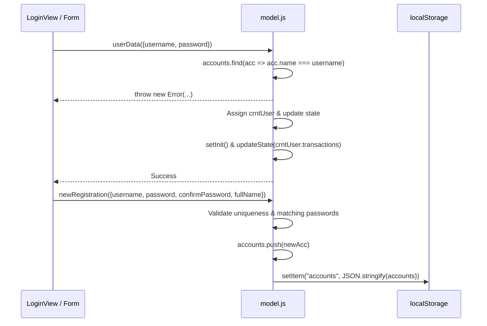
```mermaid
sequenceDiagram
    participant UI as LoginView / Form
    participant Model as model.js
    participant Storage as localStorage
    UI->>Model: userData({username, password})
    Model->>Model: accounts.find(acc => acc.name === username)
    Model-->>UI: throw new Error(...)
    Model->>Model: Assign crntUser & update state
    Model->>Model: setInit() & updateState(crntUser.transactions)
    Model-->>UI: Success
    UI->>Model: newRegistration({username, password, confirmPassword, fullName})
    Model->>Model: Validate uniqueness & matching passwords
    Model->>Model: accounts.push(newAcc)
    Model->>Storage: setItem("accounts", JSON.stringify(accounts))
```

Sources: [source/js/model.js19-54](https://github.com/rhythm162k/First-Cost/blob/5752f3ac/source/js/model.js#L19-L54)[source/js/model.js81-89](https://github.com/rhythm162k/First-Cost/blob/5752f3ac/source/js/model.js#L81-L89)

---

## Persistence and `localStorage` Integration

All modifications to account data—such as creating transactions, deleting transactions, updating themes, registering accounts, and deleting accounts—immediately persist changes back to the browser's `localStorage` using the `"accounts"` key.

- **Storage Key**: `"accounts"` [source/js/model.js:50]
- **Serialization**: `JSON.stringify(accounts)` [source/js/model.js:50]
- **Affected Functions**:

- `newRegistration` [source/js/model.js:50]
- `newTransaction` [source/js/model.js:66]
- `deleteTranx` [source/js/model.js:76]
- `deleteAcc` [source/js/model.js:88]
- `themeControl` [source/js/model.js:114]

Sources: [source/js/model.js50](https://github.com/rhythm162k/First-Cost/blob/5752f3ac/source/js/model.js#L50-L50)[source/js/model.js66](https://github.com/rhythm162k/First-Cost/blob/5752f3ac/source/js/model.js#L66-L66)[source/js/model.js76](https://github.com/rhythm162k/First-Cost/blob/5752f3ac/source/js/model.js#L76-L76)[source/js/model.js88](https://github.com/rhythm162k/First-Cost/blob/5752f3ac/source/js/model.js#L88-L88)[source/js/model.js114](https://github.com/rhythm162k/First-Cost/blob/5752f3ac/source/js/model.js#L114-L114)

---

## Theme Control and View Integration (`loginView.js`)

Theme configurations are managed via `themeControl(theme)`, which updates `crntUser.theme` and commits the change to `localStorage` [source/js/model.js:112-115].

The view layer interfaces with authentication via `LoginView` in `source/js/views/loginView.js` [source/js/views/loginView.js:3]. It coordinates screen visibility toggles between the login screen and the main application shell, and attaches logout event listeners [source/js/views/loginView.js:9-23].

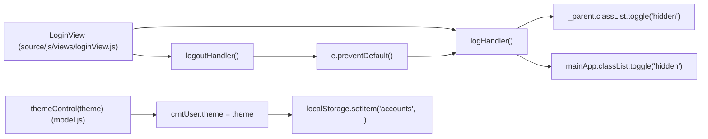
```mermaid
flowchart LR
    sub:LoginView["LoginView (source/js/views/loginView.js)"]
    logHandler["logHandler()"]
    logoutHandler["logoutHandler()"]
    toggleParent["_parent.classList.toggle('hidden')"]
    toggleApp["mainApp.classList.toggle('hidden')"]
    preventDefault["e.preventDefault()"]
    themeControl["themeControl(theme) (model.js)"]
    updateTheme["crntUser.theme = theme"]
    persistTheme["localStorage.setItem('accounts', ...)"]
    sub:LoginView --> logHandler
    sub:LoginView --> logoutHandler
    logHandler --> toggleParent
    logHandler --> toggleApp
    logoutHandler --> preventDefault
    preventDefault --> logHandler
    themeControl --> updateTheme
    updateTheme --> persistTheme
```

Sources: [source/js/model.js112-115](https://github.com/rhythm162k/First-Cost/blob/5752f3ac/source/js/model.js#L112-L115)[source/js/views/loginView.js3-24](https://github.com/rhythm162k/First-Cost/blob/5752f3ac/source/js/views/loginView.js#L3-L24)

---

# 3-View-Layer

# View Layer
Relevant source files
- [source/js/views/transactionView.js](https://github.com/rhythm162k/First-Cost/blob/5752f3ac/source/js/views/transactionView.js)
- [source/js/views/views.js](https://github.com/rhythm162k/First-Cost/blob/5752f3ac/source/js/views/views.js)

The View Layer of First Cost is responsible for rendering the application's UI and handling user interactions. It consists of several view classes located in `source/js/views/`, each managing a specific part of the application's interface. All view classes extend a shared base `Views` class [source/js/views/views.js1](https://github.com/rhythm162k/First-Cost/blob/5752f3ac/source/js/views/views.js#L1-L1) which provides common rendering utilities and handler delegation patterns.

This page provides a high-level overview of the view components and their relationships. Detailed explanations of each view and its functionalities are provided in the linked child pages.

## View Class Hierarchy

The following diagram illustrates the inheritance structure of the view classes. All specific view implementations inherit from the `Views` base class, leveraging its common functionalities.

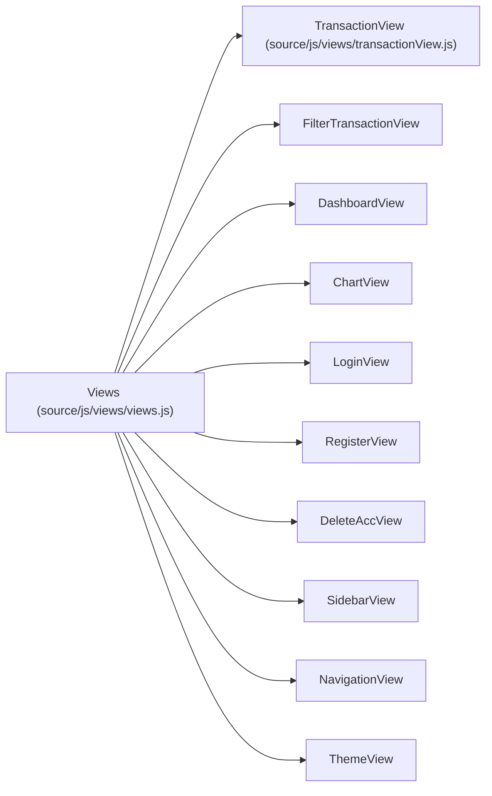
```mermaid
flowchart LR
    A["Views (source/js/views/views.js)"]
    B["TransactionView (source/js/views/transactionView.js)"]
    C["FilterTransactionView"]
    D["DashboardView"]
    E["ChartView"]
    F["LoginView"]
    G["RegisterView"]
    H["DeleteAccView"]
    I["SidebarView"]
    J["NavigationView"]
    K["ThemeView"]
    A --> B
    A --> C
    A --> D
    A --> E
    A --> F
    A --> G
    A --> H
    A --> I
    A --> J
    A --> K
```

Sources:

- [source/js/views/views.js1](https://github.com/rhythm162k/First-Cost/blob/5752f3ac/source/js/views/views.js#L1-L1)
- [source/js/views/transactionView.js3](https://github.com/rhythm162k/First-Cost/blob/5752f3ac/source/js/views/transactionView.js#L3-L3)

## Base Views Class and Rendering Patterns

The `Views` class [source/js/views/views.js1](https://github.com/rhythm162k/First-Cost/blob/5752f3ac/source/js/views/views.js#L1-L1) serves as the foundation for all other view components. It encapsulates common UI manipulation logic, such as form submission handling, toggling empty/transaction states, and displaying error messages. This base class promotes code reusability and enforces consistent interaction patterns across the application.

For details, see [Base Views Class and Rendering Patterns](/rhythm162k/First-Cost/3.1-base-views-class-and-rendering-patterns).

Sources:

- [source/js/views/views.js1-39](https://github.com/rhythm162k/First-Cost/blob/5752f3ac/source/js/views/views.js#L1-L39)

## Transactions and Filtering Views

The `TransactionView`[source/js/views/transactionView.js3](https://github.com/rhythm162k/First-Cost/blob/5752f3ac/source/js/views/transactionView.js#L3-L3) is responsible for rendering the list of financial transactions and managing interactions related to individual transactions, such as deletion. It dynamically updates the UI based on the presence or absence of transactions. The `FilterTransactionView` (not shown in provided files but implied by the TOC) handles the display and logic for filtering transactions.

The `TransactionView` uses methods like `render()`[source/js/views/transactionView.js32-40](https://github.com/rhythm162k/First-Cost/blob/5752f3ac/source/js/views/transactionView.js#L32-L40) to display transactions and `deleteTransactionHandler()`[source/js/views/transactionView.js23-30](https://github.com/rhythm162k/First-Cost/blob/5752f3ac/source/js/views/transactionView.js#L23-L30) to delegate delete actions to the controller. It also manages the visibility of the transaction form via `toggleTransactionForm()`[source/js/views/transactionView.js12-14](https://github.com/rhythm162k/First-Cost/blob/5752f3ac/source/js/views/transactionView.js#L12-L14)

For details, see [Transactions and Filtering Views](/rhythm162k/First-Cost/3.2-transactions-and-filtering-views).

Sources:

- [source/js/views/transactionView.js3-56](https://github.com/rhythm162k/First-Cost/blob/5752f3ac/source/js/views/transactionView.js#L3-L56)
- [source/js/views/views.js22-29](https://github.com/rhythm162k/First-Cost/blob/5752f3ac/source/js/views/views.js#L22-L29)

## Dashboard and Charts

The `DashboardView` and `ChartView` (not shown in provided files but implied by the TOC) are responsible for displaying aggregated financial metrics and visualizations. The `ChartView` specifically integrates with Chart.js to render interactive pie and line charts, providing a visual summary of the user's financial data. These views also handle synchronization with the application's theme for consistent visual presentation.

For details, see [Dashboard and Charts](/rhythm162k/First-Cost/3.3-dashboard-and-charts).

## Auth and Account Views

The `LoginView`, `RegisterView`, and `DeleteAccView` (not shown in provided files but implied by the TOC) manage user authentication and account management functionalities. These views typically present modal interfaces for user input, handle form submissions, display validation errors, and facilitate user logout.

For details, see [Auth and Account Views](/rhythm162k/First-Cost/3.4-auth-and-account-views).

## Navigation, Sidebar and Theme

The `SidebarView`, `NavigationView`, and `ThemeView` (not shown in provided files but implied by the TOC) control the application's overall layout and user experience. The `SidebarView` manages the visibility and content of the sidebar navigation. The `NavigationView` handles in-page navigation and scrolling. The `ThemeView` allows users to toggle between different visual themes, such as dark and light modes, ensuring a personalized user interface.

For details, see [Navigation, Sidebar and Theme](/rhythm162k/First-Cost/3.5-navigation-sidebar-and-theme).

---

# 3.1-Base-Views-Class-and-Rendering-Patterns

# Base Views Class and Rendering Patterns
Relevant source files
- [source/js/views/views.js](https://github.com/rhythm162k/First-Cost/blob/5752f3ac/source/js/views/views.js)

This page details the `Views` base class, located at [source/js/views/views.js](https://github.com/rhythm162k/First-Cost/blob/5752f3ac/source/js/views/views.js) which provides common functionalities and rendering patterns for all view classes in the application. It covers shared helper methods, mechanisms for toggling between empty and transaction states, and conventions for delegating event handlers.

## The `Views` Base Class

The `Views` class serves as the foundation for all specific view implementations within the application. It encapsulates common UI manipulation logic and event handling patterns, promoting code reuse and consistency across different parts of the user interface.

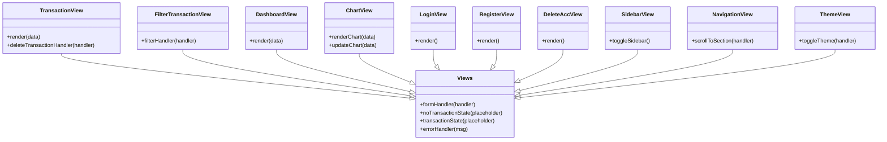
```mermaid
classDiagram
    class Views {
        +formHandler(handler)
        +noTransactionState(placeholder)
        +transactionState(placeholder)
        +errorHandler(msg)
    }
    class TransactionView {
        +render(data)
        +deleteTransactionHandler(handler)
    }
    class FilterTransactionView {
        +filterHandler(handler)
    }
    class DashboardView {
        +render(data)
    }
    class ChartView {
        +renderChart(data)
        +updateChart(data)
    }
    class LoginView {
        +render()
    }
    class RegisterView {
        +render()
    }
    class DeleteAccView {
        +render()
    }
    class SidebarView {
        +toggleSidebar()
    }
    class NavigationView {
        +scrollToSection(handler)
    }
    class ThemeView {
        +toggleTheme(handler)
    }
    TransactionView --|> Views
    FilterTransactionView --|> Views
    DashboardView --|> Views
    ChartView --|> Views
    LoginView --|> Views
    RegisterView --|> Views
    DeleteAccView --|> Views
    SidebarView --|> Views
    NavigationView --|> Views
    ThemeView --|> Views
```

Title: "Views" Class Hierarchy
Sources: [source/js/views/views.js1-39](https://github.com/rhythm162k/First-Cost/blob/5752f3ac/source/js/views/views.js#L1-L39)

### Form Handling

The `formHandler` method [source/js/views/views.js2-14](https://github.com/rhythm162k/First-Cost/blob/5752f3ac/source/js/views/views.js#L2-L14) is a generic utility for handling form submissions. It prevents default form submission behavior, clears any existing error messages, extracts form data into a plain JavaScript object, calls a provided `handler` function with the form data, and then resets the form.

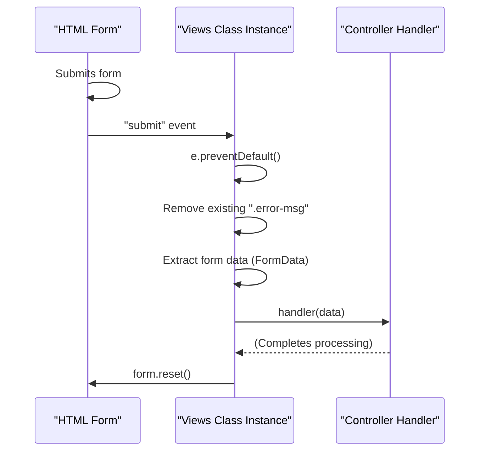
```mermaid
sequenceDiagram
    participant FormElement as "HTML Form"
    participant ViewsInstance as "Views Class Instance"
    participant ControllerHandler as "Controller Handler"
    FormElement->>FormElement: Submits form
    FormElement->>ViewsInstance: "submit" event
    ViewsInstance->>ViewsInstance: e.preventDefault()
    ViewsInstance->>ViewsInstance: Remove existing ".error-msg"
    ViewsInstance->>ViewsInstance: Extract form data (FormData)
    ViewsInstance->>ControllerHandler: handler(data)
    ControllerHandler-->>ViewsInstance: (Completes processing)
    ViewsInstance->>FormElement: form.reset()
```

Title: `formHandler` Data Flow
Sources: [source/js/views/views.js2-14](https://github.com/rhythm162k/First-Cost/blob/5752f3ac/source/js/views/views.js#L2-L14)

### Toggling Empty and Transaction States

The `Views` class provides two methods, `noTransactionState`[source/js/views/views.js16-22](https://github.com/rhythm162k/First-Cost/blob/5752f3ac/source/js/views/views.js#L16-L22) and `transactionState`[source/js/views/views.js24-29](https://github.com/rhythm162k/First-Cost/blob/5752f3ac/source/js/views/views.js#L24-L29) to manage the visibility of UI elements based on whether there are transactions to display. These methods typically toggle the `hidden` CSS class on specific DOM elements.

- `noTransactionState(placeholder)`: Hides the `placeholder` element (if provided) or `this.filterBtn`, hides the `.filter` element, and shows `this.emptyState`. This is used when there are no transactions to display.
- `transactionState(placeholder)`: Shows the `placeholder` element (if provided) or `this.filterBtn`, and hides `this.emptyState`. This is used when transactions are present.

These methods ensure that the user interface correctly reflects the current state of transactions, either showing a message indicating no transactions or displaying the transaction list and related controls.

### Error Handling

The `errorHandler` method [source/js/views/views.js31-38](https://github.com/rhythm162k/First-Cost/blob/5752f3ac/source/js/views/views.js#L31-L38) is a simple utility to display error messages within a form context. It inserts an HTML snippet with a `p` tag and the class `error-msg` at the beginning of the form (`this.form`). This provides immediate feedback to the user about input validation or other issues.

### Handler Delegation Conventions

A common pattern across view classes inheriting from `Views` is the delegation of event handling to controller functions. This is typically achieved by methods named `[eventName]Handler` (e.g., `formHandler`, `deleteTransactionHandler`[source/js/views/transactionView.js30-32](https://github.com/rhythm162k/First-Cost/blob/5752f3ac/source/js/views/transactionView.js#L30-L32)`filterHandler`[source/js/views/filterTransactionView.js10-12](https://github.com/rhythm162k/First-Cost/blob/5752f3ac/source/js/views/filterTransactionView.js#L10-L12)). These methods take a `handler` function (provided by the controller) as an argument, attach an event listener to a relevant DOM element, and then call the provided `handler` with the necessary data when the event occurs. This adheres to the MVC principle by keeping presentation logic separate from application logic.

Sources:

- [source/js/views/views.js1-39](https://github.com/rhythm162k/First-Cost/blob/5752f3ac/source/js/views/views.js#L1-L39)
- [source/js/views/transactionView.js30-32](https://github.com/rhythm162k/First-Cost/blob/5752f3ac/source/js/views/transactionView.js#L30-L32)
- [source/js/views/filterTransactionView.js10-12](https://github.com/rhythm162k/First-Cost/blob/5752f3ac/source/js/views/filterTransactionView.js#L10-L12)

---

# 3.2-Transactions-and-Filtering-Views

# Transactions and Filtering Views
Relevant source files
- [source/js/views/filterTransaction.js](https://github.com/rhythm162k/First-Cost/blob/5752f3ac/source/js/views/filterTransaction.js)
- [source/js/views/registerView.js](https://github.com/rhythm162k/First-Cost/blob/5752f3ac/source/js/views/registerView.js)
- [source/js/views/transactionView.js](https://github.com/rhythm162k/First-Cost/blob/5752f3ac/source/js/views/transactionView.js)

This page details the implementation of the `TransactionView` and `FilterTransaction` classes, which are responsible for rendering and managing user transactions, handling user interactions like deleting transactions, and managing the transaction filtering form. It covers how transactions are displayed, how user input for deletion is delegated, and how the filter form is toggled and submitted.

## TransactionView: Rendering and Interaction

The `TransactionView` class [source/js/views/transactionView.js3-57](https://github.com/rhythm162k/First-Cost/blob/5752f3ac/source/js/views/transactionView.js#L3-L57) extends the base `Views` class [source/js/views/transactionView.js1](https://github.com/rhythm162k/First-Cost/blob/5752f3ac/source/js/views/transactionView.js#L1-L1) and manages the display and interaction for individual transactions. It is responsible for rendering a list of transactions, toggling the transaction input form, and delegating delete actions.

### DOM Elements and State

The `TransactionView` class initializes several DOM elements as properties:

- `_parent`: The container for the list of transactions (`.transactions-list`) [source/js/views/transactionView.js5](https://github.com/rhythm162k/First-Cost/blob/5752f3ac/source/js/views/transactionView.js#L5-L5)
- `addTransactionBtn`: The button to add a new transaction (`.transaction-btn`) [source/js/views/transactionView.js6](https://github.com/rhythm162k/First-Cost/blob/5752f3ac/source/js/views/transactionView.js#L6-L6)
- `transactionPlate`: The transaction input form section (`.transaction-form__section`) [source/js/views/transactionView.js7](https://github.com/rhythm162k/First-Cost/blob/5752f3ac/source/js/views/transactionView.js#L7-L7)
- `form`: The transaction form itself (`.transaction-form`) [source/js/views/transactionView.js8](https://github.com/rhythm162k/First-Cost/blob/5752f3ac/source/js/views/transactionView.js#L8-L8)
- `filterBtn`: The button to add a filter (`.add-filter-btn`) [source/js/views/transactionView.js9](https://github.com/rhythm162k/First-Cost/blob/5752f3ac/source/js/views/transactionView.js#L9-L9)
- `emptyState`: The element displayed when there are no transactions (`.empty-state`) [source/js/views/transactionView.js10](https://github.com/rhythm162k/First-Cost/blob/5752f3ac/source/js/views/transactionView.js#L10-L10)

The `data` property [source/js/views/transactionView.js4](https://github.com/rhythm162k/First-Cost/blob/5752f3ac/source/js/views/transactionView.js#L4-L4) holds the array of transaction objects to be rendered.

### Rendering Transactions

The `render(data)` method [source/js/views/transactionView.js32-40](https://github.com/rhythm162k/First-Cost/blob/5752f3ac/source/js/views/transactionView.js#L32-L40) is responsible for updating the displayed list of transactions.

1. It sets the `this.data` property to the provided `data`[source/js/views/transactionView.js33](https://github.com/rhythm162k/First-Cost/blob/5752f3ac/source/js/views/transactionView.js#L33-L33)
2. It checks if `this.data` is empty and calls either `noTransactionState()` or `transactionState()` accordingly [source/js/views/transactionView.js34-36](https://github.com/rhythm162k/First-Cost/blob/5752f3ac/source/js/views/transactionView.js#L34-L36) These methods (inherited from `Views`) toggle the visibility of the empty state message.
3. It maps over the `this.data` array, calling `renderMarkup(obj)` for each transaction object to generate its HTML string [source/js/views/transactionView.js37](https://github.com/rhythm162k/First-Cost/blob/5752f3ac/source/js/views/transactionView.js#L37-L37)
4. The generated HTML strings are joined and inserted into the `_parent` element, replacing any existing content [source/js/views/transactionView.js38-39](https://github.com/rhythm162k/First-Cost/blob/5752f3ac/source/js/views/transactionView.js#L38-L39)

The `renderMarkup(data)` method [source/js/views/transactionView.js42-56](https://github.com/rhythm162k/First-Cost/blob/5752f3ac/source/js/views/transactionView.js#L42-L56) generates the HTML for a single transaction entry. It dynamically inserts the transaction's `category`, `type`, `date`, `amount`, and `id` into an `<article>` element. The `income` property is used to apply a CSS class for styling the amount [source/js/views/transactionView.js51](https://github.com/rhythm162k/First-Cost/blob/5752f3ac/source/js/views/transactionView.js#L51-L51)

### Event Handling and Delegation

#### Toggling Transaction Form

The `toggleTransactionForm()` method [source/js/views/transactionView.js12-14](https://github.com/rhythm162k/First-Cost/blob/5752f3ac/source/js/views/transactionView.js#L12-L14) simply toggles the `hidden` class on the `transactionPlate` element, showing or hiding the transaction input form.

The `addTransactionHandler()` method [source/js/views/transactionView.js16-21](https://github.com/rhythm162k/First-Cost/blob/5752f3ac/source/js/views/transactionView.js#L16-L21) attaches an event listener to the `addTransactionBtn`. When clicked, it calls `toggleTransactionForm()` to show or hide the form. The `bind(this)` ensures `this` context is correctly maintained [source/js/views/transactionView.js19](https://github.com/rhythm162k/First-Cost/blob/5752f3ac/source/js/views/transactionView.js#L19-L19)

#### Deleting Transactions

The `deleteTransactionHandler(handler)` method [source/js/views/transactionView.js23-30](https://github.com/rhythm162k/First-Cost/blob/5752f3ac/source/js/views/transactionView.js#L23-L30) implements event delegation for deleting transactions.

1. It attaches a click event listener to the `_parent` element (the transaction list container) [source/js/views/transactionView.js24](https://github.com/rhythm162k/First-Cost/blob/5752f3ac/source/js/views/transactionView.js#L24-L24)
2. Inside the listener, it checks if the clicked element or its closest ancestor is a button with the class `delete-btn`[source/js/views/transactionView.js25](https://github.com/rhythm162k/First-Cost/blob/5752f3ac/source/js/views/transactionView.js#L25-L25)
3. If a delete button is found, it retrieves the `id` attribute of that button [source/js/views/transactionView.js27](https://github.com/rhythm162k/First-Cost/blob/5752f3ac/source/js/views/transactionView.js#L27-L27)
4. Finally, it calls the provided `handler` function, passing the transaction `id` (converted to a number) [source/js/views/transactionView.js28](https://github.com/rhythm162k/First-Cost/blob/5752f3ac/source/js/views/transactionView.js#L28-L28) This `handler` is typically a controller function responsible for updating the model.

```

```

**Diagram: Transaction Deletion Event Flow**
Sources: [source/js/views/transactionView.js23-30](https://github.com/rhythm162k/First-Cost/blob/5752f3ac/source/js/views/transactionView.js#L23-L30)

Sources:

- [source/js/views/transactionView.js1-59](https://github.com/rhythm162k/First-Cost/blob/5752f3ac/source/js/views/transactionView.js#L1-L59)
- [source/js/views/registerView.js1-25](https://github.com/rhythm162k/First-Cost/blob/5752f3ac/source/js/views/registerView.js#L1-L25)

## FilterTransaction: Filtering Transactions

The `FilterTransaction` class [source/js/views/filterTransaction.js3-22](https://github.com/rhythm162k/First-Cost/blob/5752f3ac/source/js/views/filterTransaction.js#L3-L22) is responsible for managing the transaction filtering form. It also extends the base `Views` class [source/js/views/filterTransaction.js1](https://github.com/rhythm162k/First-Cost/blob/5752f3ac/source/js/views/filterTransaction.js#L1-L1)

### DOM Elements

The class initializes the following DOM elements:

- `addFilterBtn`: The button to open the filter form (`.add-filter-btn`) [source/js/views/filterTransaction.js4](https://github.com/rhythm162k/First-Cost/blob/5752f3ac/source/js/views/filterTransaction.js#L4-L4)
- `filter`: The filter form container (`.filter`) [source/js/views/filterTransaction.js5](https://github.com/rhythm162k/First-Cost/blob/5752f3ac/source/js/views/filterTransaction.js#L5-L5)
- `form`: The filter form itself (`.filter-form`) [source/js/views/filterTransaction.js6](https://github.com/rhythm162k/First-Cost/blob/5752f3ac/source/js/views/filterTransaction.js#L6-L6)
- `removeFilterBtn`: The button to remove applied filters (`.filter-remove-btn`) [source/js/views/filterTransaction.js7](https://github.com/rhythm162k/First-Cost/blob/5752f3ac/source/js/views/filterTransaction.js#L7-L7)

### Event Handling

#### Toggling Filter Form

The `toggleFilterForm()` method [source/js/views/filterTransaction.js9-11](https://github.com/rhythm162k/First-Cost/blob/5752f3ac/source/js/views/filterTransaction.js#L9-L11) toggles the `hidden` class on the `filter` element, showing or hiding the filter form.

The `addFilterBtnHandler()` method [source/js/views/filterTransaction.js13-18](https://github.com/rhythm162k/First-Cost/blob/5752f3ac/source/js/views/filterTransaction.js#L13-L18) attaches a click event listener to the `addFilterBtn`. When clicked, it calls `toggleFilterForm()` to display or hide the filter form.

#### Removing Filters

The `removeFilterHandler(handler)` method [source/js/views/filterTransaction.js20-22](https://github.com/rhythm162k/First-Cost/blob/5752f3ac/source/js/views/filterTransaction.js#L20-L22) attaches a click event listener to the `removeFilterBtn`. When this button is clicked, it executes the provided `handler` function. This `handler` is typically a controller function that resets the transaction filters in the model and re-renders the view.

```

```

**Diagram: Filter Form Interaction Flow**
Sources: [source/js/views/filterTransaction.js13-18](https://github.com/rhythm162k/First-Cost/blob/5752f3ac/source/js/views/filterTransaction.js#L13-L18)[source/js/views/filterTransaction.js20-22](https://github.com/rhythm162k/First-Cost/blob/5752f3ac/source/js/views/filterTransaction.js#L20-L22)

Sources:

- [source/js/views/filterTransaction.js1-25](https://github.com/rhythm162k/First-Cost/blob/5752f3ac/source/js/views/filterTransaction.js#L1-L25)

---

# 3.3-Dashboard-and-Charts

# Dashboard and Charts
Relevant source files
- [source/js/views/chartView.js](https://github.com/rhythm162k/First-Cost/blob/5752f3ac/source/js/views/chartView.js)
- [source/js/views/dashboardView.js](https://github.com/rhythm162k/First-Cost/blob/5752f3ac/source/js/views/dashboardView.js)

## Purpose and Scope

This page details the implementation of the dashboard metrics rendering and chart visualization components within the view layer of the First Cost codebase. Specifically, it covers `Dashboard` (implemented in `source/js/views/dashboardView.js`) which updates top-level financial metrics and user identification strings, and `ChartView` (implemented in `source/js/views/chartView.js`) which manages Chart.js instances for expense breakdown pie charts and multi-dataset monthly trends, along with theme color synchronization.

---

## 1. Dashboard Metrics (`dashboardView.js`)

The `Dashboard` class manages the DOM elements responsible for displaying aggregate user financial state and user profile information [source/js/views/dashboardView.js:1-23].

### DOM Element Bindings and Update Methods

Upon instantiation, `Dashboard` selects several container elements within the document:

- `.balance`: Bound to `this.balance` [source/js/views/dashboardView.js:2]
- `.income`: Bound to `this.income` [source/js/views/dashboardView.js:3]
- `.expenses`: Bound to `this.expenses` [source/js/views/dashboardView.js:4]
- `.savings`: Bound to `this.savings` [source/js/views/dashboardView.js:5]
- `.user-name`: Bound to `this.user` [source/js/views/dashboardView.js:6]

Each metric is updated via specific methods that inject formatted currency strings or text content directly into the DOM nodes:

- `updateBalance(bl)`: Sets `this.balance.innerHTML` to `$${bl}` [source/js/views/dashboardView.js:8-10].
- `updateIncome(inc)`: Sets `this.income.innerHTML` to `$${inc}` [source/js/views/dashboardView.js:11-13].
- `updateExpense(exp)`: Sets `this.expense.innerHTML` to `-$${exp}` [source/js/views/dashboardView.js:14-16].
- `updateSavings(save)`: Sets `this.savings.innerHTML` to `$${save}` [source/js/views/dashboardView.js:17-19].
- `updateUserName(name)`: Sets `this.user.textContent` to `${name}` [source/js/views/dashboardView.js:20-22].

```

```

Sources: `source/js/views/dashboardView.js:1-23`

---

## 2. Chart Rendering and Management (`chartView.js`)

`ChartView` extends the base `Views` class (`source/js/views/views.js:1`) and integrates with the `Chart.js` library (`chart.js/auto`) to render financial analytics [source/js/views/chartView.js:1-4].

### State Handlers and Placeholders

The class maintains references to DOM elements such as `#expenseChart`, `#monthlyChart`, `.empty-stats`, and `.chart-placeholder` [source/js/views/chartView.js:5-9]. It tracks active chart instances via `_chartInstance` (pie chart) and `_monthlyChart` (line chart) [source/js/views/chartView.js:10-11].

The `statsState(data)` method checks whether the transaction dataset is empty (`data.length === 0`), toggling between empty state handlers and transaction state handlers across all `.chart-placeholder` elements [source/js/views/chartView.js:13-21].

### Expense Pie Chart (`renderExpenseChart`)

The `renderExpenseChart(labels, data)` method initializes or mutates the pie chart instance [source/js/views/chartView.js:23-58]:

- **Initialization**: If `!this._chartInstance`, a new `Chart` is instantiated targeting `this._expenseChartEl` with `type: "pie"` [source/js/views/chartView.js:24-26]. Legend text colors are synchronized with the computed CSS variable `--text` from `this.body` [source/js/views/chartView.js:41-43].
- **Update**: If `this._chartInstance` already exists, `labels` and `data` are updated in place, followed by a call to `this._chartInstance.update()` [source/js/views/chartView.js:54-57].

### Monthly Line Chart (`renderMonthlyChart`)

The `renderMonthlyChart(labels, incomeData, expenseData, savingsData)` method manages a line chart for financial trends over time [source/js/views/chartView.js:60-125]:

- **Initialization**: If `!this._monthlyChart`, a new `Chart` targeting `this._monthlyChartEl` is created with `type: "line"` and three datasets: Income, Expense, and Savings [source/js/views/chartView.js:60-82]. Axis ticks and legend labels inherit the `--text` CSS property [source/js/views/chartView.js:88-111].
- **Update**: Existing datasets are updated with new income, expense, and savings arrays before calling `this._monthlyChart.update()` [source/js/views/chartView.js:118-124].

```

```

Sources: `source/js/views/chartView.js:1-139`

---

## 3. Theme Color Synchronization

When the application toggles themes (e.g., between light and dark modes), chart text and axis tick colors must update to maintain contrast against the background.

The `updateColors()` method reads the updated computed style of `--text` from `this.body` and re-applies it to both active chart instances [source/js/views/chartView.js:127-138]:

- Updates `this._chartInstance.options.plugins.legend.labels.color` and calls `this._chartInstance.update()` [source/js/views/chartView.js:132-133].
- Updates `this._monthlyChart.options.plugins.legend.labels.color`, `this._monthlyChart.options.scales.x.ticks.color`, and `this._monthlyChart.options.scales.y.ticks.color`, followed by `this._monthlyChart.update()` [source/js/views/chartView.js:134-137].

```

```

Sources: `source/js/views/chartView.js:127-138`

---

# 3.4-Auth-and-Account-Views

# Auth and Account Views
Relevant source files
- [source/js/views/deleteAccView.js](https://github.com/rhythm162k/First-Cost/blob/5752f3ac/source/js/views/deleteAccView.js)
- [source/js/views/filterTransaction.js](https://github.com/rhythm162k/First-Cost/blob/5752f3ac/source/js/views/filterTransaction.js)
- [source/js/views/loginView.js](https://github.com/rhythm162k/First-Cost/blob/5752f3ac/source/js/views/loginView.js)
- [source/js/views/registerView.js](https://github.com/rhythm162k/First-Cost/blob/5752f3ac/source/js/views/registerView.js)

This page details the implementation of authentication and account management views within the First Cost application. It covers the `loginView`, `registerView` (modal), `deleteAccView` (modal), error handling mechanisms, and the logout functionality. These views are responsible for user interaction related to account creation, login, and deletion, ensuring a secure and intuitive user experience.

## Login View

The `LoginView` class [source/js/views/loginView.js3-24](https://github.com/rhythm162k/First-Cost/blob/5752f3ac/source/js/views/loginView.js#L3-L24) manages the user login interface. It controls the visibility of the login screen and the main application interface.

### Implementation Details

- **DOM Elements**:

- `_parent`: The main login screen element (`.login-screen`) [source/js/views/loginView.js4](https://github.com/rhythm162k/First-Cost/blob/5752f3ac/source/js/views/loginView.js#L4-L4)
- `form`: The login form element (`.login-form`) [source/js/views/loginView.js5](https://github.com/rhythm162k/First-Cost/blob/5752f3ac/source/js/views/loginView.js#L5-L5)
- `mainApp`: The main application container (`.app`) [source/js/views/loginView.js6](https://github.com/rhythm162k/First-Cost/blob/5752f3ac/source/js/views/loginView.js#L6-L6)
- `logoutBtn`: The logout button (`.logout-btn`) [source/js/views/loginView.js7](https://github.com/rhythm162k/First-Cost/blob/5752f3ac/source/js/views/loginView.js#L7-L7)
- **`logHandler()`**: This method toggles the visibility of the login screen and the main application. It also removes any existing error messages [source/js/views/loginView.js9-16](https://github.com/rhythm162k/First-Cost/blob/5752f3ac/source/js/views/loginView.js#L9-L16)
- **`logoutHandler()`**: Attaches an event listener to the `logoutBtn` to call `logHandler()` when clicked, effectively logging the user out and returning to the login screen [source/js/views/loginView.js18-23](https://github.com/rhythm162k/First-Cost/blob/5752f3ac/source/js/views/loginView.js#L18-L23)

### Login/Logout Flow

```

```

**Diagram 1: Login/Logout Flow**

Sources:

- [source/js/views/loginView.js3-24](https://github.com/rhythm162k/First-Cost/blob/5752f3ac/source/js/views/loginView.js#L3-L24)

## Register View

The `RegisterView` class [source/js/views/registerView.js3-23](https://github.com/rhythm162k/First-Cost/blob/5752f3ac/source/js/views/registerView.js#L3-L23) handles the user registration modal. It extends the base `Views` class.

### Implementation Details

- **DOM Elements**:

- `_parent`: The registration modal element (`.register-modal`) [source/js/views/registerView.js4](https://github.com/rhythm162k/First-Cost/blob/5752f3ac/source/js/views/registerView.js#L4-L4)
- `form`: The registration form element (`.register-form`) [source/js/views/registerView.js5](https://github.com/rhythm162k/First-Cost/blob/5752f3ac/source/js/views/registerView.js#L5-L5)
- `createBtn`: The button that triggers the opening of the registration modal (`.create-acc__btn`) [source/js/views/registerView.js6](https://github.com/rhythm162k/First-Cost/blob/5752f3ac/source/js/views/registerView.js#L6-L6)
- **`modalHandler()`**: Toggles the `hidden` class on the `_parent` element to show or hide the modal [source/js/views/registerView.js8-10](https://github.com/rhythm162k/First-Cost/blob/5752f3ac/source/js/views/registerView.js#L8-L10)
- **`openRegisterModal()`**: Attaches a click event listener to `createBtn` to open the modal using `modalHandler()`[source/js/views/registerView.js12-14](https://github.com/rhythm162k/First-Cost/blob/5752f3ac/source/js/views/registerView.js#L12-L14)
- **`closeRegisterModal()`**: Attaches a click event listener to the `_parent` (modal overlay). If the click is outside the `.modal-content`, it closes the modal using `modalHandler()`[source/js/views/registerView.js16-22](https://github.com/rhythm162k/First-Cost/blob/5752f3ac/source/js/views/registerView.js#L16-L22)

### Registration Modal Interaction

```

```

**Diagram 2: Registration Modal Interaction**

Sources:

- [source/js/views/registerView.js3-23](https://github.com/rhythm162k/First-Cost/blob/5752f3ac/source/js/views/registerView.js#L3-L23)

## Delete Account View

The `DeleteAccView` class [source/js/views/deleteAccView.js3-31](https://github.com/rhythm162k/First-Cost/blob/5752f3ac/source/js/views/deleteAccView.js#L3-L31) manages the modal for deleting a user account.

### Implementation Details

- **DOM Elements**:

- `_parent`: The delete account modal element (`.delete-acc-modal`) [source/js/views/deleteAccView.js4](https://github.com/rhythm162k/First-Cost/blob/5752f3ac/source/js/views/deleteAccView.js#L4-L4)
- `loginScrn`: The login screen element (`.login-screen`) [source/js/views/deleteAccView.js5](https://github.com/rhythm162k/First-Cost/blob/5752f3ac/source/js/views/deleteAccView.js#L5-L5)
- `form`: The delete account form element (`.delete-form`) [source/js/views/deleteAccView.js6](https://github.com/rhythm162k/First-Cost/blob/5752f3ac/source/js/views/deleteAccView.js#L6-L6)
- `deleteAccBtn`: The button within the modal to confirm deletion (`.delete-acc-btn`) [source/js/views/deleteAccView.js7](https://github.com/rhythm162k/First-Cost/blob/5752f3ac/source/js/views/deleteAccView.js#L7-L7)
- `deleteAcc`: The button that opens the delete account modal (`.delete-acc`) [source/js/views/deleteAccView.js8](https://github.com/rhythm162k/First-Cost/blob/5752f3ac/source/js/views/deleteAccView.js#L8-L8)
- `mainApp`: The main application container (`.app`) [source/js/views/deleteAccView.js9](https://github.com/rhythm162k/First-Cost/blob/5752f3ac/source/js/views/deleteAccView.js#L9-L9)
- **`backToStart()`**: Hides the main application and the delete account modal, and shows the login screen. This is typically called after an account is successfully deleted [source/js/views/deleteAccView.js11-15](https://github.com/rhythm162k/First-Cost/blob/5752f3ac/source/js/views/deleteAccView.js#L11-L15)
- **`modalHandler()`**: Toggles the `hidden` class on the `_parent` element to show or hide the modal [source/js/views/deleteAccView.js17-19](https://github.com/rhythm162k/First-Cost/blob/5752f3ac/source/js/views/deleteAccView.js#L17-L19)
- **`openModal()`**: Attaches a click event listener to `deleteAcc` to open the modal using `modalHandler()`[source/js/views/deleteAccView.js21-23](https://github.com/rhythm162k/First-Cost/blob/5752f3ac/source/js/views/deleteAccView.js#L21-L23)
- **`closeModal()`**: Attaches a click event listener to the `_parent` (modal overlay). If the click is outside the `.modal-content`, it closes the modal using `modalHandler()`[source/js/views/deleteAccView.js25-30](https://github.com/rhythm162k/First-Cost/blob/5752f3ac/source/js/views/deleteAccView.js#L25-L30)

### Delete Account Flow

```

```

**Diagram 3: Delete Account Flow**

Sources:

- [source/js/views/deleteAccView.js3-31](https://github.com/rhythm162k/First-Cost/blob/5752f3ac/source/js/views/deleteAccView.js#L3-L31)

## Error Handling

Error messages are dynamically added and removed from the DOM. The `LoginView`'s `logHandler()` specifically checks for and removes any existing `.error-msg` element when the login screen state changes [source/js/views/loginView.js10-12](https://github.com/rhythm162k/First-Cost/blob/5752f3ac/source/js/views/loginView.js#L10-L12) This ensures that stale error messages are cleared when a user attempts to log in or out.

Sources:

- [source/js/views/loginView.js10-12](https://github.com/rhythm162k/First-Cost/blob/5752f3ac/source/js/views/loginView.js#L10-L12)

---

# 3.5-Navigation,-Sidebar-and-Theme

# Navigation, Sidebar and Theme
Relevant source files
- [source/js/views/navigationView.js](https://github.com/rhythm162k/First-Cost/blob/5752f3ac/source/js/views/navigationView.js)
- [source/js/views/sidebarView.js](https://github.com/rhythm162k/First-Cost/blob/5752f3ac/source/js/views/sidebarView.js)
- [source/js/views/themeView.js](https://github.com/rhythm162k/First-Cost/blob/5752f3ac/source/js/views/themeView.js)

This page details the implementation of user interface components responsible for navigation, sidebar functionality, and theme switching within the First Cost application. It covers the `sidebarView` for overlay and menu toggling, `navigationView` for anchor-based scrolling, and `themeView` for dark mode activation.

## Sidebar Functionality

The `SidebarView` class [source/js/views/sidebarView.js1-35](https://github.com/rhythm162k/First-Cost/blob/5752f3ac/source/js/views/sidebarView.js#L1-L35) manages the behavior of the application's sidebar menu and its associated overlay. It provides methods to toggle the sidebar's visibility and handles interactions that close the sidebar.

### Implementation Details

The `SidebarView` class identifies several key DOM elements:

- `_parent`: The menu button (`.menu-btn`) that triggers the sidebar [source/js/views/sidebarView.js2](https://github.com/rhythm162k/First-Cost/blob/5752f3ac/source/js/views/sidebarView.js#L2-L2)
- `sidebar`: The sidebar element itself (`.sidebar`) [source/js/views/sidebarView.js3](https://github.com/rhythm162k/First-Cost/blob/5752f3ac/source/js/views/sidebarView.js#L3-L3)
- `overlay`: A semi-transparent overlay (`.overlay`) that appears when the sidebar is open [source/js/views/sidebarView.js4](https://github.com/rhythm162k/First-Cost/blob/5752f3ac/source/js/views/sidebarView.js#L4-L4)
- `body`: The `<body>` element, used to prevent scrolling when the sidebar is open [source/js/views/sidebarView.js5](https://github.com/rhythm162k/First-Cost/blob/5752f3ac/source/js/views/sidebarView.js#L5-L5)
- `sideNavBar`: The navigation bar within the sidebar (`.side-nav-bar`) [source/js/views/sidebarView.js6](https://github.com/rhythm162k/First-Cost/blob/5752f3ac/source/js/views/sidebarView.js#L6-L6)

The core functionality is provided by the `toggleSidebarView()` method [source/js/views/sidebarView.js8-12](https://github.com/rhythm162k/First-Cost/blob/5752f3ac/source/js/views/sidebarView.js#L8-L12) This method toggles the `sidebar-open` class on the `sidebar` element, the `hidden` class on the `overlay` element, and the `no-scroll` class on the `body` element. The `no-scroll` class typically prevents the main content from scrolling while the sidebar is active.

The `revealScreen(e)` method [source/js/views/sidebarView.js14-20](https://github.com/rhythm162k/First-Cost/blob/5752f3ac/source/js/views/sidebarView.js#L14-L20) is responsible for closing the sidebar when a navigation item within it is clicked. It checks if the clicked element or its closest ancestor has the class `.navigate-to`[source/js/views/sidebarView.js15](https://github.com/rhythm162k/First-Cost/blob/5752f3ac/source/js/views/sidebarView.js#L15-L15) If so, it removes the `sidebar-open` class from the `sidebar`, adds the `hidden` class back to the `overlay`, and removes `no-scroll` from the `body`.

Event handlers are registered through:

- `addMenubarHandler()`: Attaches a click listener to the `_parent` (menu button) to call `toggleSidebarView()`[source/js/views/sidebarView.js26-28](https://github.com/rhythm162k/First-Cost/blob/5752f3ac/source/js/views/sidebarView.js#L26-L28)
- `addOverlayHandler()`: Attaches a click listener to the `overlay` to call `toggleSidebarView()`[source/js/views/sidebarView.js30-32](https://github.com/rhythm162k/First-Cost/blob/5752f3ac/source/js/views/sidebarView.js#L30-L32)
- `sideNavHandler()`: Attaches a click listener to the `sideNavBar` to call `revealScreen()`[source/js/views/sidebarView.js22-24](https://github.com/rhythm162k/First-Cost/blob/5752f3ac/source/js/views/sidebarView.js#L22-L24)

### Sidebar Interaction Flow

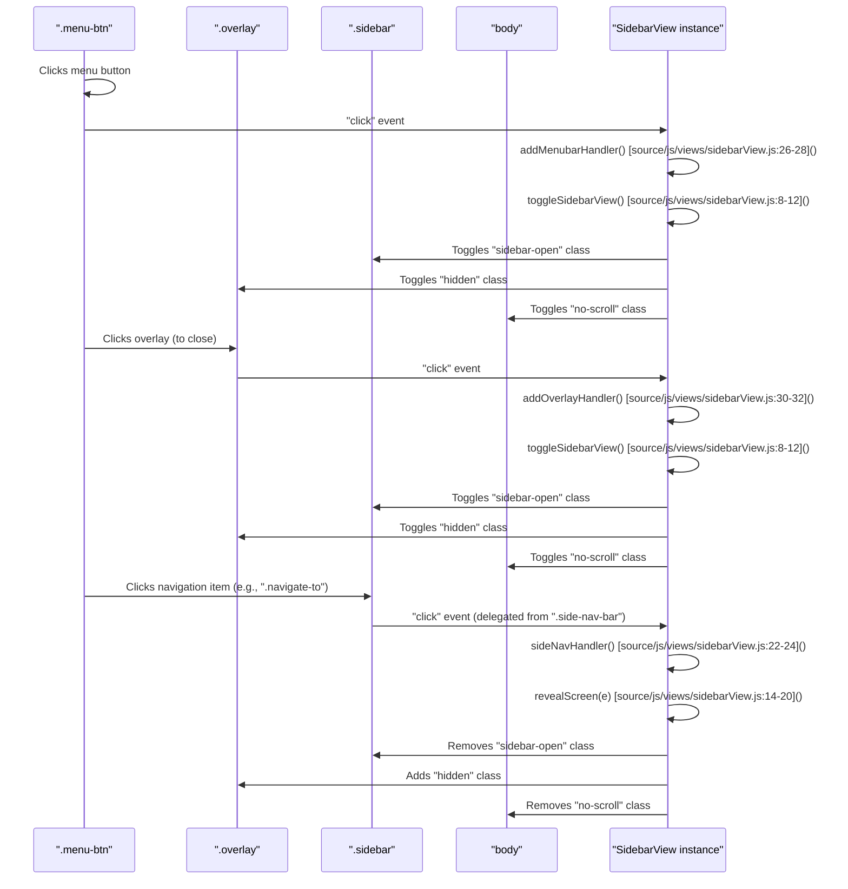
```mermaid
sequenceDiagram
    participant MenuButton as ".menu-btn"
    participant Overlay as ".overlay"
    participant Sidebar as ".sidebar"
    participant Body as "body"
    participant SidebarView as "SidebarView instance"
    MenuButton->>MenuButton: Clicks menu button
    MenuButton->>SidebarView: "click" event
    SidebarView->>SidebarView: addMenubarHandler() [source/js/views/sidebarView.js:26-28]()
    SidebarView->>SidebarView: toggleSidebarView() [source/js/views/sidebarView.js:8-12]()
    SidebarView->>Sidebar: Toggles "sidebar-open" class
    SidebarView->>Overlay: Toggles "hidden" class
    SidebarView->>Body: Toggles "no-scroll" class
    MenuButton->>Overlay: Clicks overlay (to close)
    Overlay->>SidebarView: "click" event
    SidebarView->>SidebarView: addOverlayHandler() [source/js/views/sidebarView.js:30-32]()
    SidebarView->>SidebarView: toggleSidebarView() [source/js/views/sidebarView.js:8-12]()
    SidebarView->>Sidebar: Toggles "sidebar-open" class
    SidebarView->>Overlay: Toggles "hidden" class
    SidebarView->>Body: Toggles "no-scroll" class
    MenuButton->>Sidebar: Clicks navigation item (e.g., ".navigate-to")
    Sidebar->>SidebarView: "click" event (delegated from ".side-nav-bar")
    SidebarView->>SidebarView: sideNavHandler() [source/js/views/sidebarView.js:22-24]()
    SidebarView->>SidebarView: revealScreen(e) [source/js/views/sidebarView.js:14-20]()
    SidebarView->>Sidebar: Removes "sidebar-open" class
    SidebarView->>Overlay: Adds "hidden" class
    SidebarView->>Body: Removes "no-scroll" class
```

Sources:

- [source/js/views/sidebarView.js1-35](https://github.com/rhythm162k/First-Cost/blob/5752f3ac/source/js/views/sidebarView.js#L1-L35)

## Navigation

The `NavigationView` class [source/js/views/navigationView.js1-15](https://github.com/rhythm162k/First-Cost/blob/5752f3ac/source/js/views/navigationView.js#L1-L15) is responsible for handling navigation clicks, specifically for elements that trigger anchor-based scrolling or section changes.

### Implementation Details

The `NavigationView` class selects all elements with the class `.navigation`[source/js/views/navigationView.js2](https://github.com/rhythm162k/First-Cost/blob/5752f3ac/source/js/views/navigationView.js#L2-L2) It provides a `navigateToHandler(handler)` method [source/js/views/navigationView.js4-12](https://github.com/rhythm162k/First-Cost/blob/5752f3ac/source/js/views/navigationView.js#L4-L12) which iterates over these navigation elements and attaches a click event listener to each.

When a click event occurs, it checks if the clicked element or its closest ancestor has the class `.navigate-to`[source/js/views/navigationView.js8](https://github.com/rhythm162k/First-Cost/blob/5752f3ac/source/js/views/navigationView.js#L8-L8) If a matching element is found, it calls the provided `handler` function, passing the clicked button as an argument. This allows the controller to determine the target section and perform the necessary scrolling or view update.

### Navigation Event Flow

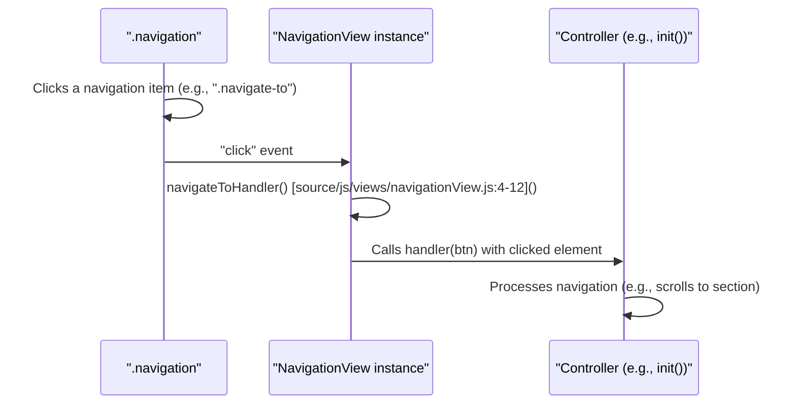
```mermaid
sequenceDiagram
    participant NavElement as ".navigation"
    participant NavigationView as "NavigationView instance"
    participant Controller as "Controller (e.g., init())"
    NavElement->>NavElement: Clicks a navigation item (e.g., ".navigate-to")
    NavElement->>NavigationView: "click" event
    NavigationView->>NavigationView: navigateToHandler() [source/js/views/navigationView.js:4-12]()
    NavigationView->>Controller: Calls handler(btn) with clicked element
    Controller->>Controller: Processes navigation (e.g., scrolls to section)
```

Sources:

- [source/js/views/navigationView.js1-15](https://github.com/rhythm162k/First-Cost/blob/5752f3ac/source/js/views/navigationView.js#L1-L15)

## Theme Toggling

The `ThemeView` class [source/js/views/themeView.js4-38](https://github.com/rhythm162k/First-Cost/blob/5752f3ac/source/js/views/themeView.js#L4-L38) manages the application's dark/light mode functionality, including updating the UI and persisting the theme choice.

### Implementation Details

The `ThemeView` class identifies the following DOM elements:

- `_parent`: The theme toggle button (`.theme`) [source/js/views/themeView.js5](https://github.com/rhythm162k/First-Cost/blob/5752f3ac/source/js/views/themeView.js#L5-L5)
- `body`: The `<body>` element, where the `dark` class is applied [source/js/views/themeView.js6](https://github.com/rhythm162k/First-Cost/blob/5752f3ac/source/js/views/themeView.js#L6-L6)
- `logoEl`: The application's logo element (`.brand-logo`) [source/js/views/themeView.js7](https://github.com/rhythm162k/First-Cost/blob/5752f3ac/source/js/views/themeView.js#L7-L7) which changes based on the theme.

It uses two image URLs for the logo: `logoLight`[source/js/views/themeView.js1](https://github.com/rhythm162k/First-Cost/blob/5752f3ac/source/js/views/themeView.js#L1-L1) and `logoDark`[source/js/views/themeView.js2](https://github.com/rhythm162k/First-Cost/blob/5752f3ac/source/js/views/themeView.js#L2-L2)

The `theme(themeState)` method [source/js/views/themeView.js9-18](https://github.com/rhythm162k/First-Cost/blob/5752f3ac/source/js/views/themeView.js#L9-L18) is used to programmatically set the theme based on a `themeState` string ("dark" or anything else for light). It updates the button's text, adds/removes the `dark` class from the `body`, and sets the appropriate logo source.

The `themeBtnHandler(handler)` method [source/js/views/themeView.js21-35](https://github.com/rhythm162k/First-Cost/blob/5752f3ac/source/js/views/themeView.js#L21-L35) attaches a click event listener to the `_parent` (theme toggle button). When clicked:

1. It toggles the `dark` class on the `body` element [source/js/views/themeView.js23](https://github.com/rhythm162k/First-Cost/blob/5752f3ac/source/js/views/themeView.js#L23-L23)
2. It determines the current theme state (`isDark`) [source/js/views/themeView.js25](https://github.com/rhythm162k/First-Cost/blob/5752f3ac/source/js/views/themeView.js#L25-L25)
3. It updates the button's text to reflect the next theme state [source/js/views/themeView.js27-29](https://github.com/rhythm162k/First-Cost/blob/5752f3ac/source/js/views/themeView.js#L27-L29)
4. It updates the logo's `src` attribute based on the current theme [source/js/views/themeView.js31](https://github.com/rhythm162k/First-Cost/blob/5752f3ac/source/js/views/themeView.js#L31-L31)
5. It calls the provided `handler` function, passing "dark" or an empty string based on the current theme [source/js/views/themeView.js33](https://github.com/rhythm162k/First-Cost/blob/5752f3ac/source/js/views/themeView.js#L33-L33) This handler is typically used by the controller to persist the theme choice in the model.

### Theme Toggling Flow

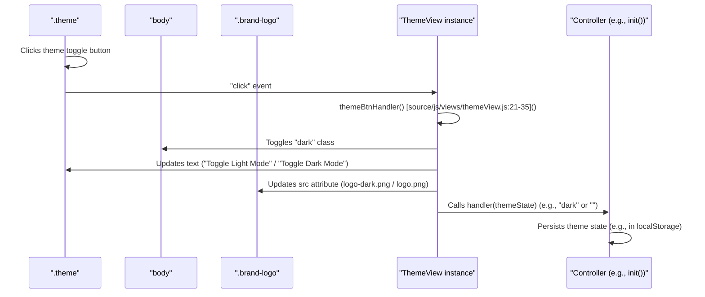
```mermaid
sequenceDiagram
    participant ThemeButton as ".theme"
    participant Body as "body"
    participant Logo as ".brand-logo"
    participant ThemeView as "ThemeView instance"
    participant Controller as "Controller (e.g., init())"
    ThemeButton->>ThemeButton: Clicks theme toggle button
    ThemeButton->>ThemeView: "click" event
    ThemeView->>ThemeView: themeBtnHandler() [source/js/views/themeView.js:21-35]()
    ThemeView->>Body: Toggles "dark" class
    ThemeView->>ThemeButton: Updates text ("Toggle Light Mode" / "Toggle Dark Mode")
    ThemeView->>Logo: Updates src attribute (logo-dark.png / logo.png)
    ThemeView->>Controller: Calls handler(themeState) (e.g., "dark" or "")
    Controller->>Controller: Persists theme state (e.g., in localStorage)
```

Sources:

- [source/js/views/themeView.js1-38](https://github.com/rhythm162k/First-Cost/blob/5752f3ac/source/js/views/themeView.js#L1-L38)

---

# 4-UI-Markup-and-Styling

# UI Markup and Styling
Relevant source files
- [index.html](https://github.com/rhythm162k/First-Cost/blob/5752f3ac/index.html)
- [style.css](https://github.com/rhythm162k/First-Cost/blob/5752f3ac/style.css)

This page provides a high-level overview of the user interface (UI) markup and styling within the First Cost Single Page Application (SPA). It describes the structure of the main `index.html` file, the CSS architecture, and how image assets are integrated. The UI is designed to be responsive and themeable, adapting to different screen sizes and user preferences.

The application's UI is primarily defined by a single `index.html` file, which serves as the SPA shell, and a `style.css` file that provides all the styling. JavaScript dynamically manipulates this DOM structure and applies/removes classes to control visibility and content.

## index.html DOM Contract

The `index.html` file defines the core structure of the application, including the initial login screen, modals for registration and account management, and the main application interface. It uses semantic HTML5 elements and relies heavily on `id` and `class` attributes as hooks for JavaScript to interact with and manipulate the DOM. Key sections include the authentication screens, the main application container (`#app`), the sidebar navigation, the topbar, and various content sections like the dashboard and transaction lists. Modals, such as the registration modal (`#registerModal`), are initially hidden using the `hidden` class and revealed by JavaScript.

For details on specific sections, IDs/classes used as JS hooks, modals, forms, and navigation structures, see [index.html DOM Contract](/rhythm162k/First-Cost/4.1-index.html-dom-contract).

```

```

Title: High-Level `index.html` Structure
Sources: [index.html1-376](https://github.com/rhythm162k/First-Cost/blob/5752f3ac/index.html#L1-L376)

## Stylesheet and Theming

The `style.css` file defines the visual presentation of the application. It utilizes CSS variables (`:root`) to establish a theming system, supporting both light and dark modes. The `body.dark` class overrides these variables to switch the theme. The layout is primarily managed using CSS Grid for the main application structure (`.app`) and flexbox for components like the topbar and transaction items. Responsive design is achieved through media queries, adapting the layout for mobile and desktop views. A set of utility classes, such as `.hidden`[style.css38-40](https://github.com/rhythm162k/First-Cost/blob/5752f3ac/style.css#L38-L40) and various button styles, are used throughout the application for common UI patterns.

For a detailed breakdown of CSS variables, light/dark themes, grid layout, responsive breakpoints, and utility classes, see [Stylesheet and Theming](/rhythm162k/First-Cost/4.2-stylesheet-and-theming).

```

```

Title: `style.css` Architecture Overview
Sources: [style.css1-24](https://github.com/rhythm162k/First-Cost/blob/5752f3ac/style.css#L1-L24)[style.css38-40](https://github.com/rhythm162k/First-Cost/blob/5752f3ac/style.css#L38-L40)[style.css136-140](https://github.com/rhythm162k/First-Cost/blob/5752f3ac/style.css#L136-L140)[style.css228-234](https://github.com/rhythm162k/First-Cost/blob/5752f3ac/style.css#L228-L234)

## Image Assets

The application incorporates various image assets, primarily for branding and iconography. These assets are located in the `source/img` directory. This includes the main brand logo (`logo.png`) used in the topbar [index.html108-112](https://github.com/rhythm162k/First-Cost/blob/5752f3ac/index.html#L108-L112) and favicon/touch icons (`taka.png`) [index.html7-9](https://github.com/rhythm162k/First-Cost/blob/5752f3ac/index.html#L7-L9) These images contribute to the overall visual identity and user experience of the application.

For more information on the specific icons and logos and their usage, see [Image Assets](/rhythm162k/First-Cost/4.3-image-assets).
Sources: [index.html7-9](https://github.com/rhythm162k/First-Cost/blob/5752f3ac/index.html#L7-L9)[index.html108-112](https://github.com/rhythm162k/First-Cost/blob/5752f3ac/index.html#L108-L112)

---

# 4.1-index.html-DOM-Contract

# 4.1 index.html DOM Contract
Relevant source files
- [index.html](https://github.com/rhythm162k/First-Cost/blob/5752f3ac/index.html)

## Purpose and Scope

This page documents the structure and DOM contract of the main HTML file `index.html` of the First Cost application. It details the key sections, element IDs, and class names that serve as hooks for JavaScript interaction. The document serves as a definitive reference for the SPA shell's markup, highlighting modals, forms, mobile/desktop navigation elements, and their relationships with the JavaScript layer, ensuring maintainability and clarity of the UI's dynamic behavior.

---

## 1. High-Level Sections and Visibility States

`index.html` is a single-page application shell that controls visibility of major UI states using CSS class toggling (`hidden` class) and explicit section IDs.

- **Login Screen** — `<section id="authScreen" class="auth-screen login-screen">`
Contains login form visible by default on page load.
- **Register Modal** — `<div id="registerModal" class="modal register-modal hidden">`
Initially hidden modal for user registration.
- **Main Application Shell** — `<div id="app" class="app hidden">`
The main app content, revealed only after successful login.

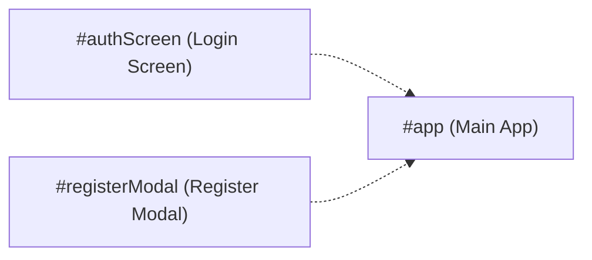
```mermaid
flowchart LR
    AuthScreen["#authScreen (Login Screen)"]
    RegisterModal["#registerModal (Register Modal)"]
    AppShell["#app (Main App)"]
    AuthScreen -.-> AppShell
    RegisterModal -.-> AppShell
```

**Sources:**[index.html16-38](https://github.com/rhythm162k/First-Cost/blob/5752f3ac/index.html#L16-L38)[index.html41-77](https://github.com/rhythm162k/First-Cost/blob/5752f3ac/index.html#L41-L77)[index.html80-376](https://github.com/rhythm162k/First-Cost/blob/5752f3ac/index.html#L80-L376)

---

## 2. Authentication Screens and Modals

### 2.1 Login Screen (`#authScreen`)

- Container for login UI with form `.login-form`.
- Inputs: `username` (text), `password` (password), and login submit button.
- "Create Account" button of class `.create-acc__btn` triggers showing the registration modal.

### 2.2 Register Modal (`#registerModal`)

- Modal container with `.modal` and `.register-modal` classes, hidden initially.
- Registration form `.register-form` with fullName, username, password, confirmPassword fields.
- Submit button triggers registration logic.

**JavaScript Hooks:**

- `.create-acc__btn` — listens for click event to open register modal.
- `#registerModal` — modal visibility toggled by JS.

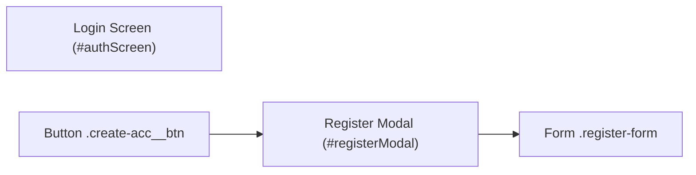
```mermaid
flowchart LR
    LoginScreen["Login Screen (#authScreen)"]
    CreateAccBtn["Button .create-acc__btn"]
    RegisterModal["Register Modal (#registerModal)"]
    RegisterForm["Form .register-form"]
    CreateAccBtn --> RegisterModal
    RegisterModal --> RegisterForm
```

**Sources:**[index.html16-38](https://github.com/rhythm162k/First-Cost/blob/5752f3ac/index.html#L16-L38)[index.html41-77](https://github.com/rhythm162k/First-Cost/blob/5752f3ac/index.html#L41-L77)

---

## 3. Main Application Shell (`#app`)

Contains the core UI after successful auth, initially hidden with class `.hidden`.

### 3.1 Sidebar (`<aside class="sidebar">`)

- Title: "First Cost"
- Navigation `<nav class="navigation side-nav-bar">` composed of buttons with class `.navigate-to`.
- Nav buttons:

- Dashboard (`href="#dashboard"`)
- Transactions (`href="#transactions"`)
- Statistics (`href="#statsSection"`)
- Settings (`href="#settingsSection"`)

Sidebar is primarily desktop navigation; it is toggled by the mobile menu button.

### 3.2 Top Bar (`<header class="topbar">`)

- Contains:

- Mobile menu toggle button `.menu-btn`
- User welcome display `.user-name`
- Brand logo image `.brand-logo`

### 3.3 Dashboard Section (`<section id="dashboard">`)

- Contains card grid `.cards-grid` with four `.card` articles:

- Balance (`.balance`), Income (`.income`), Expenses (`.expenses`), Savings (`.savings`)
- These display financial summary metrics dynamically updated by JS.

### 3.4 Add Transaction Button

- Button `.transaction-btn` triggers reveal of the transaction form.

### 3.5 Transaction Form Section (`<section id="transactionForm" class="panel transaction-form__section hidden">`)

- Initially hidden form panel for adding a new transaction.
- Form `.transaction-form` includes:

- Select `#type` for transaction type (income, expense, savings)
- Inputs: category, amount, date, description
- Submit button `.save-transaction-btn`

---

```

```

**Sources:**[index.html80-207](https://github.com/rhythm162k/First-Cost/blob/5752f3ac/index.html#L80-L207)

---

## 4. Navigation Interaction and Responsive Behavior

### 4.1 Navigation Buttons

- The `.navigate-to` buttons in sidebar have `href` attributes indicating target sections.
- These buttons trigger scrolling or panel display changes via JS navigation controllers.
- Navigation classes are used as hooks for event listeners.

### 4.2 Mobile Navigation Toggle

- `.menu-btn` in the top bar toggles sidebar visibility on smaller viewports.
- This supports responsive design by showing/hiding the sidebar.
- Sidebar overlays on mobile when toggled, otherwise persistent on desktop.

**Sources:**[index.html85-98](https://github.com/rhythm162k/First-Cost/blob/5752f3ac/index.html#L85-L98)[index.html102-114](https://github.com/rhythm162k/First-Cost/blob/5752f3ac/index.html#L102-L114)

---

## 5. Modal and Form Visibility Control: CSS Hooks

- The CSS class `.hidden` is the primary mechanism toggled by JS to show/hide modals, forms, and main content.
- Examples:

- Register modal (`#registerModal`) starts with `.hidden`
- Main application div (`#app`) starts with `.hidden`
- Transaction form section (`#transactionForm`) starts with `.hidden`
- The login screen (`#authScreen`) does **not** have `.hidden` initially, showing login UI on launch.

**Sources:**[index.html16-38](https://github.com/rhythm162k/First-Cost/blob/5752f3ac/index.html#L16-L38)[index.html41-77](https://github.com/rhythm162k/First-Cost/blob/5752f3ac/index.html#L41-L77)[index.html80-207](https://github.com/rhythm162k/First-Cost/blob/5752f3ac/index.html#L80-L207)

---

## 6. Summary Table of Important IDs and Classes

| Element Description | Tag | ID / Class | JS Purpose |
| --- | --- | --- | --- |
| Login Screen | section | `id="authScreen"`, classes: `.auth-screen` | Container for login UI |
| Register Modal | div | `id="registerModal"`, classes: `.modal`, `.register-modal`, `.hidden` | Registration modal form container |
| Main Application Container | div | `id="app"`, classes: `.app`, `.hidden` | Wrapper for main UI, shown after auth |
| Sidebar | aside | class `.sidebar` | Navigation container |
| Navigation Buttons | button | class `.navigate-to` | SPA navigation triggers |
| Top Bar | header | class `.topbar` | Contains menu and welcome display |
| Menu Button (mobile nav) | button | class `.menu-btn` | Triggers sidebar toggle |
| Dashboard Section | section | `id="dashboard"`, class `.dashboard-section` | Displays financial cards |
| Dashboard Cards (Balance etc) | p | classes `.balance`, `.income`, `.expenses`, `.savings` | Shows dynamic balances |
| Add Transaction Button | button | class `.transaction-btn` | Opens transaction form |
| Transaction Form Section | section | `id="transactionForm"`, classes `.transaction-form__section`, `.hidden` | Add/edit transaction form container |
| Transaction Form | form | class `.transaction-form` | Form inputs for transaction data |

---

## 7. Mapping Natural Language UI Components to Code Entities

This diagram shows the mapping from natural UI sections to their corresponding key DOM elements (called by JS) and relevant JS handlers (in `controller.js`):

```mermaid
flowchart LR
    UI_Login["Login Screen"]
    Login_AuthScreen["#authScreen"]
    Login_Form[".login-form"]
    Btn_CreateAcc[".create-acc__btn"]
    UI_RegisterModal["Register Modal"]
    Register_Modal["#registerModal"]
    Register_Form[".register-form"]
    UI_MainApp["Main Application After Login"]
    App_Div["#app"]
    Sidebar["aside.sidebar"]
    NavButtons[".navigate-to buttons"]
    TopBar["header.topbar"]
    MenuBtn[".menu-btn"]
    DashboardSec["section#dashboard"]
    Cards[".balance, .income, .expenses, .savings"]
    AddTranxBtn[".transaction-btn"]
    TranxFormSection["section#transactionForm"]
    TranxForm[".transaction-form"]
    UI_Login --> Login_AuthScreen
    Login_AuthScreen --> Login_Form
    Login_AuthScreen --> Btn_CreateAcc
    Btn_CreateAcc --> UI_RegisterModal
    UI_RegisterModal --> Register_Modal
    Register_Modal --> Register_Form
    UI_MainApp --> App_Div
    App_Div --> Sidebar
    Sidebar --> NavButtons
    App_Div --> TopBar
    TopBar --> MenuBtn
    App_Div --> DashboardSec
    DashboardSec --> Cards
    App_Div --> AddTranxBtn
    App_Div --> TranxFormSection
    TranxFormSection --> TranxForm
```

**Sources:**[index.html16-207](https://github.com/rhythm162k/First-Cost/blob/5752f3ac/index.html#L16-L207)

---

## 8. Data Flow and JS Hook Relationships

The visible UI states and forms are toggled by the JavaScript controller (`source/js/controller.js`):

- On app start, only login section (`#authScreen`) visible.
- Clicking `.create-acc__btn` reveals the register modal (`#registerModal`).
- Successful login hides login screen and reveals main app container (`#app`).
- Navigation buttons (`.navigate-to`) scroll or show respective main content panels.
- `.menu-btn` toggles sidebar visibility on mobile.
- Clicking “+ Add Transaction” (`.transaction-btn`) shows transaction form (`#transactionForm`).
- Submitting transaction form via `.save-transaction-btn` triggers transaction addition.

This dynamic toggling relies on the shared use of IDs and classes specified here as JavaScript hooks into the DOM tree.

---

# Summary

This DOM contract specifies the static HTML element structure including all key IDs and classes used by JavaScript as interaction hooks. The page uses layered visibility toggling with the `.hidden` class to manage authentication flows and main app UI states. Navigation buttons feature explicit `href` attributes used for smooth scrolling and panel toggling. The login and register forms are isolated with distinct containers and modals. Sidebar and topbar UI components handle navigation and user context display. Transaction form visibility is carefully controlled for SPA behavior, with semantic labels and input fields correctly hooked for data-binding in the controller.

---

# Appendix: Important Line Ranges in `index.html`

| Section | Line Numbers |
| --- | --- |
| Login Screen | 16 - 38 |
| Register Modal | 41 - 77 |
| Main App Container start | 80 - onwards |
| Sidebar and Navigation | 81 - 99 |
| Top Bar | 101 - 114 |
| Dashboard | 117 - 139 |
| Add Transaction Button | 141 - 145 |
| Transaction Form Section | 148 - 207 |

---

**Sources:**[index.html1-207](https://github.com/rhythm162k/First-Cost/blob/5752f3ac/index.html#L1-L207)

---

# 4.2-Stylesheet-and-Theming

# Stylesheet and Theming
Relevant source files
- [source/js/views/themeView.js](https://github.com/rhythm162k/First-Cost/blob/5752f3ac/source/js/views/themeView.js)
- [style.css](https://github.com/rhythm162k/First-Cost/blob/5752f3ac/style.css)

This page details the styling approach used in the First Cost application, covering CSS variables for theming, light and dark mode implementation, the grid-based layout system, responsive design breakpoints, and common utility classes. The primary stylesheet is `style.css`, which defines the visual presentation of the entire application.

## CSS Variables and Theming

The application utilizes CSS custom properties (variables) to manage its color palette, spacing, and other visual attributes. This approach facilitates easy theming, particularly for switching between light and dark modes.

The `:root` pseudo-class defines the default (light) theme variables [style.css1-12](https://github.com/rhythm162k/First-Cost/blob/5752f3ac/style.css#L1-L12) These include colors for background (`--bg`), surfaces (`--surface`), primary actions (`--primary`), positive feedback (`--positive`), negative feedback (`--negative`), text (`--text`), muted text (`--muted`), borders (`--border`), shadows (`--shadow`), and border radius (`--radius`).

```
:root {
  --bg: #f4f7fb;
  --surface: #ffffff;
  --primary: #007aff;
  --positive: #34c759;
  --negative: #ff3b30;
  --text: #111827;
  --muted: #6b7280;
  --border: #e5e7eb;
  --shadow: 0 10px 30px rgba(0, 0, 0, 0.08);
  --radius: 20px;
}
```

Sources: [style.css1-12](https://github.com/rhythm162k/First-Cost/blob/5752f3ac/style.css#L1-L12)

### Light and Dark Themes

The dark theme is implemented by overriding these CSS variables when the `body` element has the `dark` class [style.css14-24](https://github.com/rhythm162k/First-Cost/blob/5752f3ac/style.css#L14-L24) This allows for a complete visual transformation of the UI by simply toggling a single class on the `body`.

```
body.dark {
  --bg: #111827;
  --surface: #1f2937;
  --primary: #0a84ff;
  --positive: #30d158;
  --negative: #ff453a;
  --text: #f9fafb;
  --muted: #9ca3af;
  --border: #374151;
  --shadow: 0 10px 30px rgba(0, 0, 0, 0.3);
}
```

The `ThemeView` class [source/js/views/themeView.js4-38](https://github.com/rhythm162k/First-Cost/blob/5752f3ac/source/js/views/themeView.js#L4-L38) is responsible for managing the theme state in the DOM.

- The `theme(themeState)` method [source/js/views/themeView.js9-19](https://github.com/rhythm162k/First-Cost/blob/5752f3ac/source/js/views/themeView.js#L9-L19) applies the theme based on the `themeState` argument. It adds or removes the `dark` class from the `body` element [source/js/views/themeView.js12-16](https://github.com/rhythm162k/First-Cost/blob/5752f3ac/source/js/views/themeView.js#L12-L16) and updates the text content of the theme toggle button [source/js/views/themeView.js11-15](https://github.com/rhythm162k/First-Cost/blob/5752f3ac/source/js/views/themeView.js#L11-L15) It also dynamically switches the application logo between `logoDark` and `logoLight`[source/js/views/themeView.js13-17](https://github.com/rhythm162k/First-Cost/blob/5752f3ac/source/js/views/themeView.js#L13-L17)
- The `themeBtnHandler(handler)` method [source/js/views/themeView.js21-35](https://github.com/rhythm162k/First-Cost/blob/5752f3ac/source/js/views/themeView.js#L21-L35) attaches an event listener to the theme toggle button. When clicked, it toggles the `dark` class on the `body`[source/js/views/themeView.js24](https://github.com/rhythm162k/First-Cost/blob/5752f3ac/source/js/views/themeView.js#L24-L24) updates the button text [source/js/views/themeView.js27-29](https://github.com/rhythm162k/First-Cost/blob/5752f3ac/source/js/views/themeView.js#L27-L29) changes the logo source [source/js/views/themeView.js31](https://github.com/rhythm162k/First-Cost/blob/5752f3ac/source/js/views/themeView.js#L31-L31) and calls the provided `handler` function with the current theme state (`"dark"` or `""`) [source/js/views/themeView.js33](https://github.com/rhythm162k/First-Cost/blob/5752f3ac/source/js/views/themeView.js#L33-L33)

```

```

**Diagram: Theme Toggling Flow**
Sources: [style.css14-24](https://github.com/rhythm162k/First-Cost/blob/5752f3ac/style.css#L14-L24)[source/js/views/themeView.js4-38](https://github.com/rhythm162k/First-Cost/blob/5752f3ac/source/js/views/themeView.js#L4-L38)

## Grid Layout

The application uses CSS Grid for its main layout structure and for arranging elements within components.

The primary application layout is defined by the `.app` class, which creates a two-column grid: one for the sidebar and one for the main content [style.css136-140](https://github.com/rhythm162k/First-Cost/blob/5752f3ac/style.css#L136-L140)

```
.app {
  display: grid;
  grid-template-columns: 260px 1fr;
  min-height: 100vh;
}
```

Other key grid layouts include:

- `.auth-screen`: Centers authentication cards vertically and horizontally [style.css42-47](https://github.com/rhythm162k/First-Cost/blob/5752f3ac/style.css#L42-L47)
- `.auth-form`: Arranges form elements in a single column with a gap [style.css65-68](https://github.com/rhythm162k/First-Cost/blob/5752f3ac/style.css#L65-L68)
- `.modal`: Centers modal content within the viewport [style.css119-124](https://github.com/rhythm162k/First-Cost/blob/5752f3ac/style.css#L119-L124)
- `.cards-grid`: Displays dashboard summary cards in a four-column grid [style.css236-239](https://github.com/rhythm162k/First-Cost/blob/5752f3ac/style.css#L236-L239)
- `.filter-add-delete-btn`: Arranges filter and action buttons [style.css217-221](https://github.com/rhythm162k/First-Cost/blob/5752f3ac/style.css#L217-L221)
- `.form-grid`: A generic grid for form elements [style.css267-270](https://github.com/rhythm162k/First-Cost/blob/5752f3ac/style.css#L267-L270)
- `.form-transaction`: Specific 3-column grid for transaction forms [style.css272-274](https://github.com/rhythm162k/First-Cost/blob/5752f3ac/style.css#L272-L274)
- `.form-filter`: Specific 4-column grid for filter forms [style.css276-278](https://github.com/rhythm162k/First-Cost/blob/5752f3ac/style.css#L276-L278)
- `.transactions-list`: Arranges individual transaction items [style.css323-331](https://github.com/rhythm162k/First-Cost/blob/5752f3ac/style.css#L323-L331)

Sources: [style.css42-47](https://github.com/rhythm162k/First-Cost/blob/5752f3ac/style.css#L42-L47)[style.css65-68](https://github.com/rhythm162k/First-Cost/blob/5752f3ac/style.css#L65-L68)[style.css119-124](https://github.com/rhythm162k/First-Cost/blob/5752f3ac/style.css#L119-L124)[style.css136-140](https://github.com/rhythm162k/First-Cost/blob/5752f3ac/style.css#L136-L140)[style.css217-221](https://github.com/rhythm162k/First-Cost/blob/5752f3ac/style.css#L217-L221)[style.css236-239](https://github.com/rhythm162k/First-Cost/blob/5752f3ac/style.css#L236-L239)[style.css267-270](https://github.com/rhythm162k/First-Cost/blob/5752f3ac/style.css#L267-L270)[style.css272-274](https://github.com/rhythm162k/First-Cost/blob/5752f3ac/style.css#L272-L274)[style.css276-278](https://github.com/rhythm162k/First-Cost/blob/5752f3ac/style.css#L276-L278)[style.css323-331](https://github.com/rhythm162k/First-Cost/blob/5752f3ac/style.css#L323-L331)

## Responsive Breakpoints

The application uses media queries to adapt its layout and styling for different screen sizes, primarily targeting mobile and desktop views.

Key responsive adjustments include:

- **Mobile Navigation**: The sidebar (`.sidebar`) is hidden by default on smaller screens and becomes an overlay when opened [style.css400-408](https://github.com/rhythm162k/First-Cost/blob/5752f3ac/style.css#L400-L408) A mobile navigation bar (`.mobile-nav`) and menu button (`.menu-btn__div`) are displayed on screens smaller than 900px [style.css389-398](https://github.com/rhythm162k/First-Cost/blob/5752f3ac/style.css#L389-L398)
- **Main Layout**: The `.app` grid switches from a two-column layout to a single column on screens smaller than 900px, with the sidebar positioned absolutely [style.css380-387](https://github.com/rhythm162k/First-Cost/blob/5752f3ac/style.css#L380-L387)
- **Card Grid**: The `.cards-grid` adjusts its column count based on screen width, going from 4 columns to 2 columns at 900px [style.css410-413](https://github.com/rhythm162k/First-Cost/blob/5752f3ac/style.css#L410-L413) and then to 1 column at 600px [style.css415-418](https://github.com/rhythm162k/First-Cost/blob/5752f3ac/style.css#L415-L418)
- **Form Grids**: The `.form-transaction` and `.form-filter` grids collapse to a single column on smaller screens [style.css420-429](https://github.com/rhythm162k/First-Cost/blob/5752f3ac/style.css#L420-L429)
- **Transaction List**: The `.transactions-list` removes its shadow on smaller screens [style.css431-434](https://github.com/rhythm162k/First-Cost/blob/5752f3ac/style.css#L431-L434)
- **Transaction Item**: Individual `.transaction` items adjust their layout to stack elements vertically on very small screens [style.css436-445](https://github.com/rhythm162k/First-Cost/blob/5752f3ac/style.css#L436-L445)

```

```

**Diagram: Responsive Layout Adjustments**
Sources: [style.css380-445](https://github.com/rhythm162k/First-Cost/blob/5752f3ac/style.css#L380-L445)

## Utility Classes

Several utility classes are defined to provide common styling patterns and control element visibility.

- `.hidden`: This class sets `display: none !important`[style.css38-40](https://github.com/rhythm162k/First-Cost/blob/5752f3ac/style.css#L38-L40) effectively hiding an element from the DOM and accessibility tree. It is frequently used by JavaScript to toggle the visibility of elements like modals, empty states, or loading indicators.
- `.btn`, `.btn-primary`, `.btn-secondary`, `.btn-danger`: These classes define the base styles for buttons and their variations (primary, secondary, danger) [style.css83-104](https://github.com/rhythm162k/First-Cost/blob/5752f3ac/style.css#L83-L104)
- `.auth-screen`, `.auth-card`: Used for styling the authentication pages and their central card container [style.css42-55](https://github.com/rhythm162k/First-Cost/blob/5752f3ac/style.css#L42-L55)
- `.modal`, `.modal-content`: Used for styling modal dialogs [style.css119-134](https://github.com/rhythm162k/First-Cost/blob/5752f3ac/style.css#L119-L134)
- `.card`, `.panel`: Generic classes for container elements with background, border-radius, and shadow [style.css242-247](https://github.com/rhythm162k/First-Cost/blob/5752f3ac/style.css#L242-L247)
- `.income`, `.expenses`, `.balance`: Classes to apply specific colors and font weights to financial figures based on their type [style.css348-361](https://github.com/rhythm162k/First-Cost/blob/5752f3ac/style.css#L348-L361)
- `.empty-state`, `.empty-stats`: Classes for displaying messages when there is no data to show [style.css316-321](https://github.com/rhythm162k/First-Cost/blob/5752f3ac/style.css#L316-L321)

Sources: [style.css38-40](https://github.com/rhythm162k/First-Cost/blob/5752f3ac/style.css#L38-L40)[style.css42-55](https://github.com/rhythm162k/First-Cost/blob/5752f3ac/style.css#L42-L55)[style.css83-104](https://github.com/rhythm162k/First-Cost/blob/5752f3ac/style.css#L83-L104)[style.css119-134](https://github.com/rhythm162k/First-Cost/blob/5752f3ac/style.css#L119-L134)[style.css242-247](https://github.com/rhythm162k/First-Cost/blob/5752f3ac/style.css#L242-L247)[style.css316-321](https://github.com/rhythm162k/First-Cost/blob/5752f3ac/style.css#L316-L321)[style.css348-361](https://github.com/rhythm162k/First-Cost/blob/5752f3ac/style.css#L348-L361)

---

# 4.3-Image-Assets

# Image Assets
Relevant source files
- [source/img/dashboard.png](https://github.com/rhythm162k/First-Cost/blob/5752f3ac/source/img/dashboard.png)
- [source/img/graph.png](https://github.com/rhythm162k/First-Cost/blob/5752f3ac/source/img/graph.png)
- [source/img/logo.png](https://github.com/rhythm162k/First-Cost/blob/5752f3ac/source/img/logo.png)
- [source/img/settings.png](https://github.com/rhythm162k/First-Cost/blob/5752f3ac/source/img/settings.png)
- [source/img/taka.png](https://github.com/rhythm162k/First-Cost/blob/5752f3ac/source/img/taka.png)
- [source/img/transaction.png](https://github.com/rhythm162k/First-Cost/blob/5752f3ac/source/img/transaction.png)

This page details the image assets used in the First-Cost application, specifically focusing on icons and logos located in the `source/img` directory. It covers their purpose, where they are used within the application's UI, particularly in the navigation and top bar, and how they are referenced in the codebase.

## Image Asset Overview

The `source/img` directory contains various PNG image files that serve as visual elements throughout the application. These include:

- `logo.png`: The primary application logo.
- `dashboard.png`: An icon representing the dashboard section.
- `transaction.png`: An icon representing the transactions section.
- `graph.png`: An icon representing the charts/graph section.
- `settings.png`: An icon for application settings.
- `taka.png`: An icon likely representing currency or a specific financial element.

These images are integral to the user interface, providing visual cues and branding.

Sources:

- [source/img/logo.png](https://github.com/rhythm162k/First-Cost/blob/5752f3ac/source/img/logo.png)
- [source/img/dashboard.png](https://github.com/rhythm162k/First-Cost/blob/5752f3ac/source/img/dashboard.png)
- [source/img/transaction.png](https://github.com/rhythm162k/First-Cost/blob/5752f3ac/source/img/transaction.png)
- [source/img/graph.png](https://github.com/rhythm162k/First-Cost/blob/5752f3ac/source/img/graph.png)
- [source/img/settings.png](https://github.com/rhythm162k/First-Cost/blob/5752f3ac/source/img/settings.png)
- [source/img/taka.png](https://github.com/rhythm162k/First-Cost/blob/5752f3ac/source/img/taka.png)

## Usage in Navigation and Top Bar

The primary usage of these image assets is within the application's navigation and top bar. They are typically embedded using `` tags, with their `src` attribute pointing to the respective image file.

### Application Logo

The `logo.png`[source/img/logo.png](https://github.com/rhythm162k/First-Cost/blob/5752f3ac/source/img/logo.png) is used as the main branding element in the top-left corner of the application's header. It is typically wrapped in an anchor tag to serve as a link back to the dashboard or home page.

### Navigation Icons

Icons such as `dashboard.png`[source/img/dashboard.png](https://github.com/rhythm162k/First-Cost/blob/5752f3ac/source/img/dashboard.png)`transaction.png`[source/img/transaction.png](https://github.com/rhythm162k/First-Cost/blob/5752f3ac/source/img/transaction.png)`graph.png`[source/img/graph.png](https://github.com/rhythm162k/First-Cost/blob/5752f3ac/source/img/graph.png) and `settings.png`[source/img/settings.png](https://github.com/rhythm162k/First-Cost/blob/5752f3ac/source/img/settings.png) are used within the navigation menu to visually represent different sections of the application. These icons enhance usability by providing quick visual identification of menu items.

### Other Icons

The `taka.png`[source/img/taka.png](https://github.com/rhythm162k/First-Cost/blob/5752f3ac/source/img/taka.png) image is likely used in specific contexts, possibly related to currency display or other financial indicators, though its exact usage is not explicitly detailed in the provided snippets.

### Implementation Details

When the application is built using Parcel, these image assets are processed and hashed to ensure cache busting and efficient loading. The `public-url` option in Parcel ensures that the paths to these assets are correctly resolved relative to the application's root, which is crucial for deployment on platforms like GitHub Pages [5.1. Parcel Build Pipeline](https://github.com/rhythm162k/First-Cost/blob/5752f3ac/5.1. Parcel Build Pipeline)

The `index.html` file defines the structure where these images are embedded. For example, the logo might be found within a `<header>` or `<nav>` element, and navigation icons within `<ul>` or `<ol>` lists as part of navigation links.

```
<!-- Example structure from index.html (conceptual) -->
<header class="header">
  <a href="#" class="logo-link">
    
  </a>
  <nav class="main-nav">
    <ul>
      <li><a href="#dashboard"> Dashboard</a></li>
      <li><a href="#transactions"> Transactions</a></li>
      <!-- ... other navigation items ... -->
    </ul>
  </nav>
</header>
```

The actual paths in the deployed application will include a hash generated by Parcel, for example, `docs/assets/logo.a1b2c3d4.png`[5.2. docs/ Build Artifacts](https://github.com/rhythm162k/First-Cost/blob/5752f3ac/5.2. docs/ Build Artifacts)

### Diagram: Image Asset Flow

```mermaid
flowchart LR
    A["source/img/logo.png"]
    B["Parcel Build Process"]
    A1["source/img/dashboard.png"]
    A2["source/img/transaction.png"]
    A3["source/img/graph.png"]
    A4["source/img/settings.png"]
    A5["source/img/taka.png"]
    C["docs/assets/logo..png"]
    C1["docs/assets/dashboard..png"]
    C2["docs/assets/transaction..png"]
    C3["docs/assets/graph..png"]
    C4["docs/assets/settings..png"]
    C5["docs/assets/taka..png"]
    D["index.html:"]
    E["index.html:"]
    F["index.html:"]
    G["index.html:"]
    H["index.html:"]
    I["index.html:"]
    J["Browser Display: Application Logo"]
    K["Browser Display: Dashboard Icon"]
    L["Browser Display: Transaction Icon"]
    M["Browser Display: Graph Icon"]
    N["Browser Display: Settings Icon"]
    O["Browser Display: Taka Icon"]
    A --> B
    A1 --> B
    A2 --> B
    A3 --> B
    A4 --> B
    A5 --> B
    B --> C
    B --> C1
    B --> C2
    B --> C3
    B --> C4
    B --> C5
    C --> D
    C1 --> E
    C2 --> F
    C3 --> G
    C4 --> H
    C5 --> I
    D --> J
    E --> K
    F --> L
    G --> M
    H --> N
    I --> O
```

Sources:

- [source/img/logo.png](https://github.com/rhythm162k/First-Cost/blob/5752f3ac/source/img/logo.png)
- [source/img/dashboard.png](https://github.com/rhythm162k/First-Cost/blob/5752f3ac/source/img/dashboard.png)
- [source/img/transaction.png](https://github.com/rhythm162k/First-Cost/blob/5752f3ac/source/img/transaction.png)
- [source/img/graph.png](https://github.com/rhythm162k/First-Cost/blob/5752f3ac/source/img/graph.png)
- [source/img/settings.png](https://github.com/rhythm162k/First-Cost/blob/5752f3ac/source/img/settings.png)
- [source/img/taka.png](https://github.com/rhythm162k/First-Cost/blob/5752f3ac/source/img/taka.png)
- [5.1. Parcel Build Pipeline](https://github.com/rhythm162k/First-Cost/blob/5752f3ac/5.1. Parcel Build Pipeline)
- [5.2. docs/ Build Artifacts](https://github.com/rhythm162k/First-Cost/blob/5752f3ac/5.2. docs/ Build Artifacts)

### Diagram: UI Element to Image Asset Mapping

```mermaid
flowchart LR
    subgraph subGraph1 ["Code Entities (File Paths)"]
        ImgLogo["source/img/logo.png"]
        ImgDashboard["source/img/dashboard.png"]
        ImgTransaction["source/img/transaction.png"]
        ImgGraph["source/img/graph.png"]
        ImgSettings["source/img/settings.png"]
        ImgTaka["source/img/taka.png"]
    end
    subgraph subGraph0 ["UI Elements (Natural Language)"]
        UILogo["Application Logo"]
        UIDashboardIcon["Dashboard Icon"]
        UITransactionIcon["Transaction Icon"]
        UIGraphIcon["Graph Icon"]
        UISettingsIcon["Settings Icon"]
        UITakaIcon["Taka Icon"]
    end
    UILogo --> ImgLogo
    UIDashboardIcon --> ImgDashboard
    UITransactionIcon --> ImgTransaction
    UIGraphIcon --> ImgGraph
    UISettingsIcon --> ImgSettings
    UITakaIcon --> ImgTaka
```

Sources:

- [source/img/logo.png](https://github.com/rhythm162k/First-Cost/blob/5752f3ac/source/img/logo.png)
- [source/img/dashboard.png](https://github.com/rhythm162k/First-Cost/blob/5752f3ac/source/img/dashboard.png)
- [source/img/transaction.png](https://github.com/rhythm162k/First-Cost/blob/5752f3ac/source/img/transaction.png)
- [source/img/graph.png](https://github.com/rhythm162k/First-Cost/blob/5752f3ac/source/img/graph.png)
- [source/img/settings.png](https://github.com/rhythm162k/First-Cost/blob/5752f3ac/source/img/settings.png)
- [source/img/taka.png](https://github.com/rhythm162k/First-Cost/blob/5752f3ac/source/img/taka.png)

---

# 5-Build-and-Deployment

# Build and Deployment
Relevant source files
- [docs/index.html](https://github.com/rhythm162k/First-Cost/blob/5752f3ac/docs/index.html)
- [package.json](https://github.com/rhythm162k/First-Cost/blob/5752f3ac/package.json)

This page provides a high-level overview of the build and deployment process for the First Cost application. It covers how the project is built using Parcel, the scripts involved in the development and deployment workflows, and how the application is prepared for hosting on GitHub Pages. Detailed explanations of the Parcel build pipeline and the structure of the generated build artifacts are provided in the child pages.

For details on the Parcel build process, see [Parcel Build Pipeline](/rhythm162k/First-Cost/5.1-parcel-build-pipeline).
For details on the generated build artifacts, see [docs/ Build Artifacts](/rhythm162k/First-Cost/5.2-docs-build-artifacts).

## Build Process Overview

The First Cost application utilizes Parcel as its bundler, simplifying the development and build process. Parcel automatically handles asset compilation, optimization, and dependency resolution. The `package.json` file defines several npm scripts that orchestrate these tasks, including starting a development server, creating a production build, and preparing the output for deployment to GitHub Pages.

The core build logic involves compiling the source files (`index.html`, JavaScript, CSS, and assets) into optimized bundles. For deployment to GitHub Pages, these optimized files are then moved into a `docs/` directory, which GitHub Pages uses to serve the static site.

Sources:

- [package.json8-11](https://github.com/rhythm162k/First-Cost/blob/5752f3ac/package.json#L8-L11)

### Build and Deployment Workflow

The following diagram illustrates the high-level workflow for building and deploying the First Cost application.

```

```

**Diagram 1: Build and Deployment Workflow**

Sources:

- [package.json8-11](https://github.com/rhythm162k/First-Cost/blob/5752f3ac/package.json#L8-L11)

The `npm start` script initiates a development server, allowing for live reloading and easy debugging during development. The `npm run build` script performs a production-ready build, outputting optimized assets to the `dist/` directory. Finally, `npm run deploy` leverages the build output and prepares it for GitHub Pages by copying the contents of `dist/` to `docs/`.

For a detailed breakdown of each script and its functionality, see [Parcel Build Pipeline](/rhythm162k/First-Cost/5.1-parcel-build-pipeline).

### GitHub Pages Deployment

The `docs/` directory is crucial for GitHub Pages deployment. GitHub Pages is configured to serve content directly from this directory in the repository's root. The `npm run deploy` script ensures that the optimized build artifacts are placed in `docs/`, making the application accessible online.

The `index.html` file within the `docs/` directory serves as the entry point for the deployed application. It references the bundled JavaScript and CSS files, which include hashed filenames for cache busting.

Sources:

- [package.json11](https://github.com/rhythm162k/First-Cost/blob/5752f3ac/package.json#L11-L11)
- [docs/index.html1](https://github.com/rhythm162k/First-Cost/blob/5752f3ac/docs/index.html#L1-L1)

For more information on the contents of the `docs/` directory and the nature of the generated files, see [docs/ Build Artifacts](/rhythm162k/First-Cost/5.2-docs-build-artifacts).

---

# 5.1-Parcel-Build-Pipeline

# 5.1. Parcel Build Pipeline
Relevant source files
- [.gitignore](https://github.com/rhythm162k/First-Cost/blob/5752f3ac/.gitignore)
- [package.json](https://github.com/rhythm162k/First-Cost/blob/5752f3ac/package.json)

This page details the Parcel build pipeline used in the First Cost application. It covers the `npm` scripts for starting the development server, building the production-ready assets, and deploying them to the `docs/` directory for GitHub Pages hosting. A key aspect discussed is how Parcel handles asset bundling and ensures correct relative paths for deployment.

## Development and Build Scripts

The `package.json` file defines several `npm` scripts that automate common development and build tasks. These scripts leverage Parcel, a zero-configuration web application bundler, to process the application's source code.

### `start` Script

The `start` script initiates a development server using Parcel. This command is primarily used during active development, providing features like hot module replacement (HMR) for a fast feedback loop.

```
npm start
```

This command executes `parcel index.html`[package.json9](https://github.com/rhythm162k/First-Cost/blob/5752f3ac/package.json#L9-L9) which tells Parcel to use `index.html` as the entry point for the application. Parcel then bundles all linked assets (JavaScript, CSS, images, etc.) and serves them from a local development server.

### `build` Script

The `build` script is responsible for creating optimized, production-ready bundles of the application.

```
npm run build
```

This command executes `parcel build index.html --public-url ./`[package.json10](https://github.com/rhythm162k/First-Cost/blob/5752f3ac/package.json#L10-L10) The `parcel build` command triggers Parcel's production build process, which includes optimizations like minification, tree-shaking, and asset hashing. The `--public-url ./` flag is crucial for ensuring that all asset paths within the generated `dist/` directory are relative to the root of the deployment. This is essential for hosting on platforms like GitHub Pages, where the application might not be served from the root domain.

### `deploy` Script

The `deploy` script combines the build process with a step to prepare the artifacts for GitHub Pages deployment.

```
npm run deploy
```

This command executes `rm -rf dist docs && npm run build && cp -R dist docs`[package.json11](https://github.com/rhythm162k/First-Cost/blob/5752f3ac/package.json#L11-L11)

1. `rm -rf dist docs`: This first step removes any existing `dist/` and `docs/` directories to ensure a clean build.
2. `npm run build`: This then executes the `build` script, generating the optimized production assets into the `dist/` directory.
3. `cp -R dist docs`: Finally, it copies the entire contents of the `dist/` directory into a new `docs/` directory. GitHub Pages is configured to serve content from the `docs/` folder in the repository's root.

Sources:

- [package.json8-12](https://github.com/rhythm162k/First-Cost/blob/5752f3ac/package.json#L8-L12)

## Parcel Build Process Overview

The following diagram illustrates the flow of the Parcel build pipeline, from source files to deployed artifacts.

```mermaid
flowchart TD
    subgraph subGraph2 ["Build & Deployment Workflow"]
        L["dist/ (optimized assets)"]
        M["Relative Paths"]
        P["Copy (cp -R dist docs)"]
        Q["docs/ (for GitHub Pages)"]
        R["GitHub Pages Deployment"]
        subgraph subGraph0 ["Source Code"]
            K["Parcel Build"]
            E["style.css"]
            F["img/"]
            subgraph subGraph1 ["Development Workflow"]
                J["npm run build"]
                N["npm run deploy"]
                O["Clean (rm -rf dist docs)"]
                G["npm start"]
                H["Parcel Dev Server"]
                I["Browser (localhost)"]
                A["index.html"]
                B["main.js"]
                C["model.js"]
                D["views/"]
            end
        end
    end
    J --> K
    K --> L
    L --> M
    N --> O
    O --> J
    L --> P
    P --> Q
    Q --> R
    G --> H
    H --> I
    A --> B
    B --> C
    B --> D
    B --> E
    E --> F
```

**Diagram: Parcel Build Pipeline Flow**

Sources:

- [package.json9-11](https://github.com/rhythm162k/First-Cost/blob/5752f3ac/package.json#L9-L11)

## Public URL and Relative Paths

A critical aspect of the build configuration for GitHub Pages is the `--public-url ./` flag used in the `build` script [package.json10](https://github.com/rhythm162k/First-Cost/blob/5752f3ac/package.json#L10-L10)

When Parcel bundles assets, it typically generates absolute paths for resources (e.g., `/js/main.123abc.js`). However, GitHub Pages often serves repositories from a subpath (e.g., `https://username.github.io/repository-name/`). If absolute paths were used, the browser would try to fetch assets from `https://username.github.io/js/main.123abc.js`, which would result in a 404 error.

By specifying `--public-url ./`, Parcel is instructed to generate relative paths for all bundled assets. For example, instead of `/js/main.123abc.js`, it might generate `js/main.123abc.js`. This ensures that when the application is served from `https://username.github.io/repository-name/`, the browser correctly resolves the asset paths relative to the current HTML document (e.g., `https://username.github.io/repository-name/js/main.123abc.js`).

This configuration is vital for the correct functioning of the deployed application on GitHub Pages.

Sources:

- [package.json10](https://github.com/rhythm162k/First-Cost/blob/5752f3ac/package.json#L10-L10)

## Ignored Files

The `.gitignore` file specifies files and directories that should be excluded from version control. This includes build artifacts and temporary files generated by Parcel and Node.js.

```
.parcel-cache
dist
node_modules

```

- `.parcel-cache`: This directory is used by Parcel for caching build results to speed up subsequent builds. It's temporary and not needed in the repository.
- `dist`: This directory contains the production-ready output of the Parcel build. Since these are generated files, they are not committed to the repository.
- `node_modules`: This directory contains all the project's dependencies installed via `npm`. It can be recreated by running `npm install` and is therefore excluded.

Sources:

- [.gitignore1-3](https://github.com/rhythm162k/First-Cost/blob/5752f3ac/.gitignore#L1-L3)

---

# 5.2-docs-Build-Artifacts

# docs/ Build Artifacts
Relevant source files
- [docs/FirstCost.0d169a86.css](https://github.com/rhythm162k/First-Cost/blob/5752f3ac/docs/FirstCost.0d169a86.css)
- [docs/FirstCost.1c27c253.js](https://github.com/rhythm162k/First-Cost/blob/5752f3ac/docs/FirstCost.1c27c253.js)
- [docs/FirstCost.1c27c253.js.map](https://github.com/rhythm162k/First-Cost/blob/5752f3ac/docs/FirstCost.1c27c253.js.map)
- [docs/FirstCost.3a01df49.css](https://github.com/rhythm162k/First-Cost/blob/5752f3ac/docs/FirstCost.3a01df49.css)
- [docs/FirstCost.3fcc5188.js](https://github.com/rhythm162k/First-Cost/blob/5752f3ac/docs/FirstCost.3fcc5188.js)
- [docs/FirstCost.3fcc5188.js.map](https://github.com/rhythm162k/First-Cost/blob/5752f3ac/docs/FirstCost.3fcc5188.js.map)
- [docs/dashboard.682a48d6.png](https://github.com/rhythm162k/First-Cost/blob/5752f3ac/docs/dashboard.682a48d6.png)
- [docs/index.html](https://github.com/rhythm162k/First-Cost/blob/5752f3ac/docs/index.html)
- [docs/logo.918719e7.png](https://github.com/rhythm162k/First-Cost/blob/5752f3ac/docs/logo.918719e7.png)

This page details the build artifacts generated by the Parcel bundler and deployed to the `docs/` directory. These files are the result of the build process and are optimized for production. It is crucial **not to directly edit** any files within the `docs/` directory, as they are automatically generated and will be overwritten during subsequent builds.

The `docs/` directory contains the following types of artifacts:

- **Hashed JavaScript Bundles**: Optimized and minified JavaScript files with content-based hashes in their filenames for cache busting.
- **Hashed CSS Bundles**: Optimized and minified CSS files with content-based hashes in their filenames.
- **Source Maps**: Files that map the minified code back to the original source code, useful for debugging in production environments.
- **Hashed Image Assets**: Image files (e.g., PNGs) with content-based hashes in their filenames.

## Build Artifacts Overview

The Parcel build process takes the source files from `source/` and transforms them into optimized, production-ready assets in the `docs/` directory. This includes bundling JavaScript, CSS, and image assets, minifying them, and adding content hashes to their filenames.

### `index.html`

The `index.html` file in the `docs/` directory is the entry point of the application. It references the generated JavaScript and CSS bundles, as well as image assets, using their hashed filenames.

For example, the `index.html` file includes:

- A `<link>` tag for the main CSS bundle: `<link rel=stylesheet href=FirstCost.0d169a86.css>`[docs/index.html1](https://github.com/rhythm162k/First-Cost/blob/5752f3ac/docs/index.html#L1-L1)
- A `<script>` tag for the main JavaScript bundle: `<script type=module src=FirstCost.1c27c253.js></script>`[docs/index.html1](https://github.com/rhythm162k/First-Cost/blob/5752f3ac/docs/index.html#L1-L1)
- An `<link>` tag for the favicon: `<link rel=icon type=image/png href=taka.83d426cd.png>`[docs/index.html1](https://github.com/rhythm162k/First-Cost/blob/5752f3ac/docs/index.html#L1-L1)
- An `` tag for the brand logo: ``[docs/index.html71](https://github.com/rhythm162k/First-Cost/blob/5752f3ac/docs/index.html#L71-L71)

Notice the hashes (`0d169a86`, `1c27c253`, `83d426cd`, `918719e7`) embedded in the filenames. These hashes change only when the content of the respective file changes, ensuring that browsers fetch the latest version of the assets when an update occurs, while still allowing for aggressive caching of unchanged assets.

Sources:

- [docs/index.html1](https://github.com/rhythm162k/First-Cost/blob/5752f3ac/docs/index.html#L1-L1)
- [docs/index.html71](https://github.com/rhythm162k/First-Cost/blob/5752f3ac/docs/index.html#L71-L71)

### JavaScript Bundles and Source Maps

The main JavaScript bundle, such as `FirstCost.1c27c253.js`, contains the entire application logic, bundled and minified by Parcel. Alongside this, a corresponding source map file, `FirstCost.1c27c253.js.map`, is generated. This source map allows developers to debug the original source code in the browser's developer tools, even though the deployed code is minified.

The JavaScript bundle includes Parcel's internal module system and HMR (Hot Module Replacement) capabilities, which are stripped out for production builds but remain in the development build.

Sources:

- [docs/FirstCost.1c27c253.js1-16](https://github.com/rhythm162k/First-Cost/blob/5752f3ac/docs/FirstCost.1c27c253.js#L1-L16)
- [docs/FirstCost.1c27c253.js.map1](https://github.com/rhythm162k/First-Cost/blob/5752f3ac/docs/FirstCost.1c27c253.js.map#L1-L1)
- [docs/FirstCost.3fcc5188.js1-223](https://github.com/rhythm162k/First-Cost/blob/5752f3ac/docs/FirstCost.3fcc5188.js#L1-L223)
- [docs/FirstCost.3fcc5188.js.map1](https://github.com/rhythm162k/First-Cost/blob/5752f3ac/docs/FirstCost.3fcc5188.js.map#L1-L1)

### CSS Bundles

The CSS bundle, for example, `FirstCost.0d169a86.css`, contains all the styles for the application. This file is also minified and includes a content hash. The CSS defines global styles, theme variables (`:root` and `.dark` selectors), and responsive breakpoints.

Sources:

- [docs/FirstCost.0d169a86.css1-2](https://github.com/rhythm162k/First-Cost/blob/5752f3ac/docs/FirstCost.0d169a86.css#L1-L2)
- [docs/FirstCost.3a01df49.css1-376](https://github.com/rhythm162k/First-Cost/blob/5752f3ac/docs/FirstCost.3a01df49.css#L1-L376)

### Image Assets

Image assets, such as `logo.918719e7.png` and `dashboard.682a48d6.png`, are also processed by Parcel. They are copied to the `docs/` directory and their filenames are hashed. This ensures that image assets benefit from the same cache-busting mechanism as JavaScript and CSS files.

Sources:

- [docs/logo.918719e7.png1-62](https://github.com/rhythm162k/First-Cost/blob/5752f3ac/docs/logo.918719e7.png#L1-L62)
- [docs/dashboard.682a48d6.png1-19](https://github.com/rhythm162k/First-Cost/blob/5752f3ac/docs/dashboard.682a48d6.png#L1-L19)

## Build Process Diagram

The following diagram illustrates the transformation of source files into build artifacts within the `docs/` directory.

```mermaid
flowchart LR
    subgraph subGraph2 ["Build Artifacts (docs/)"]
        docs_HTML["docs/index.html"]
        docs_JS["docs/FirstCost.1c27c253.js"]
        docs_JS_MAP["docs/FirstCost.1c27c253.js.map"]
        docs_CSS["docs/FirstCost.0d169a86.css"]
        docs_IMG_LOGO["docs/logo.918719e7.png"]
        docs_IMG_DASH["docs/dashboard.682a48d6.png"]
    end
    subgraph subGraph1 ["Parcel Build Process"]
        P["Parcel Bundler"]
        JS_OUT["Hashed JS Bundle: FirstCost.xxxx.js"]
        JS_MAP["JS Source Map: FirstCost.xxxx.js.map"]
        CSS_OUT["Hashed CSS Bundle: FirstCost.xxxx.css"]
        IMG_OUT["Hashed Image: logo.xxxx.png"]
        HTML_OUT["index.html"]
    end
    subgraph subGraph0 ["Source Files (source/)"]
        A["source/js/controller.js"]
        B["source/js/model.js"]
        C["source/js/views/*.js"]
        D["source/scss/*.scss"]
        E["source/img/*.png"]
        F["index.html"]
    end
    P --> JS_OUT
    P --> JS_MAP
    P --> CSS_OUT
    P --> IMG_OUT
    P --> HTML_OUT
    F --> P
    A --> P
    B --> P
    C --> P
    D --> P
    E --> P
    JS_OUT --> docs_JS
    JS_MAP --> docs_JS_MAP
    CSS_OUT --> docs_CSS
    IMG_OUT --> docs_IMG_LOGO
    IMG_OUT --> docs_IMG_DASH
    HTML_OUT --> docs_HTML
    docs_HTML --> docs_JS
    docs_HTML --> docs_CSS
    docs_HTML --> docs_IMG_LOGO
```

**Diagram: Parcel Build Process and Artifacts**

Sources:

- [docs/index.html1](https://github.com/rhythm162k/First-Cost/blob/5752f3ac/docs/index.html#L1-L1)
- [docs/index.html71](https://github.com/rhythm162k/First-Cost/blob/5752f3ac/docs/index.html#L71-L71)
- [docs/FirstCost.1c27c253.js1-16](https://github.com/rhythm162k/First-Cost/blob/5752f3ac/docs/FirstCost.1c27c253.js#L1-L16)
- [docs/FirstCost.1c27c253.js.map1](https://github.com/rhythm162k/First-Cost/blob/5752f3ac/docs/FirstCost.1c27c253.js.map#L1-L1)
- [docs/FirstCost.0d169a86.css1-2](https://github.com/rhythm162k/First-Cost/blob/5752f3ac/docs/FirstCost.0d169a86.css#L1-L2)
- [docs/FirstCost.3a01df49.css1-376](https://github.com/rhythm162k/First-Cost/blob/5752f3ac/docs/FirstCost.3a01df49.css#L1-L376)
- [docs/logo.918719e7.png1-62](https://github.com/rhythm162k/First-Cost/blob/5752f3ac/docs/logo.918719e7.png#L1-L62)
- [docs/dashboard.682a48d6.png1-19](https://github.com/rhythm162k/First-Cost/blob/5752f3ac/docs/dashboard.682a48d6.png#L1-L19)

## Warning: Do Not Edit Generated Files

As highlighted, the files in the `docs/` directory are generated automatically by the build process. Any manual changes made to these files will be lost the next time the project is built. To make changes to the application, always modify the source files located in the `source/` directory.

This separation ensures a clean development workflow and prevents accidental overwrites of production-optimized code.

---

# 6-Glossary

# Glossary
Relevant source files
- [index.html](https://github.com/rhythm162k/First-Cost/blob/5752f3ac/index.html)
- [source/js/controller.js](https://github.com/rhythm162k/First-Cost/blob/5752f3ac/source/js/controller.js)
- [source/js/model.js](https://github.com/rhythm162k/First-Cost/blob/5752f3ac/source/js/model.js)
- [source/js/views/chartView.js](https://github.com/rhythm162k/First-Cost/blob/5752f3ac/source/js/views/chartView.js)

This glossary provides detailed definitions and explanations of key domain concepts and codebase terms used throughout the First Cost client-side personal finance diary application. It connects natural language domain terms with their corresponding code entities—variables, functions, classes, and UI components—along with detailed notes on implementation patterns and data flow. This page serves as a technical reference for developers to understand how important concepts are represented and manipulated in the code, facilitating navigation and maintenance of the codebase.

---

## 1. State and Persistent Data Entities

### `state`

The `state` object models the current user session's domain state and aggregates financial metrics. It includes user information, the list of transactions, and summary balances:

```
export const state = {
  fullName: "",          // User's full name
  name: "",              // Username identifier
  transaction: [],       // Array of transaction objects for current user
  theme: "",             // Current UI theme string
  balace: 0,             // Current balance (income - expense - savings)
  income: 0,             // Sum of income transactions
  expense: 0,            // Sum of expense transactions
  savings: 0,            // Sum of savings transactions
};
```

This `state` is maintained and updated within `model.js` and used throughout views and controllers to synchronize the UI.

### `accounts`

An array holding all user accounts retrieved from `localStorage` under the `"accounts"` key. Each account is an object containing user credentials, preferences, and transactions.

### `crntUser`

Holds the currently authenticated user's account object once logged in. This variable is central to all data mutation operations, linking the current session's actions to persisted user data.

### Relationship Diagram: User Data and State Flow

```mermaid
flowchart TD
    localStorage["localStorage: 'accounts'"]
    accounts["accounts Array"]
    crntUser["crntUser (current user account)"]
    state["state (Session State)"]
    views["Various Views & Controllers"]
    localStorage --> accounts
    accounts --> crntUser
    crntUser --> state
    state --> views
```

*Sources: `source/js/model.js:1-17``source/js/controller.js:15-18`*

---

## 2. Transactions and Their Types

### Transaction Object

A transaction represents a financial event with these properties:

- `id` (number): Unique identifier, randomly assigned.
- `date` (string): ISO date string of the transaction.
- `category` (string): User-defined transaction category (e.g., "Groceries").
- `amount` (number): Numeric value of the transaction amount.
- `type` (string): The transaction type, one of `"income"`, `"expense"`, or `"savings"`.
- `description` (string): Optional free-text description.

Example:

```
{
  id: 123456,
  date: "2024-04-01",
  category: "Salary",
  amount: 1000,
  type: "income",
  description: "April salary",
}
```

### Transaction Types

- **Income**: Money received, increments total income and balance.
- **Expense**: Money spent, increments total expenses and decreases balance.
- **Savings**: Money set aside as savings, tracked separately and deducts from balance similarly to expenses.

These types drive the financial summary calculations and visualizations.

### Transactions Data Flow

- New transactions are inserted at the start of the user's transactions array using `unshift`.
- Deleted by `id` via `findIndex` and `splice`.
- Filtered with `filterTRX(data)` by category, date, and type criteria.
- Used to compute aggregates in the `state` object (income, expense, savings, balance).

```mermaid
flowchart LR
    NewTransaction["model.newTransaction(data)"]
    DeleteTransaction["model.deleteTranx(id)"]
    FilterTransaction["model.filterTRX(filters)"]
    stateUpdate["updateState(transactions) updates state income/expense/savings/balace"]
    transactions["crntUser.transactions (Array)"]
    filteredTRX["filteredTRX (Array)"]
    NewTransaction --> transactions
    DeleteTransaction --> transactions
    transactions --> stateUpdate
    FilterTransaction --> filteredTRX
```

*Sources: `source/js/model.js:56-79, 91-110, 117-132``source/js/controller.js:58-69,71-74`*

---

## 3. `filterTRX` - Transaction Filtering

`filterTRX` is a function used by the controller to extract a subset of transactions matching user filter criteria submitted via the filter form:

- **Input:** Filter object with optional `category`, `date`, and `type`
- **Behavior:** Returns all transactions from the current `state.transaction` list where:

- the transaction category contains the filter `category` substring (case-insensitive),
- the transaction date matches filter `date` (strict equality),
- the transaction type matches filter `type` (case-insensitive).

This function does not modify the stored transactions but returns filtered views to be rendered.

```mermaid
sequenceDiagram
    participant UI as Filter UI
    participant Controller
    participant Model
    participant transactionView
    UI->>Controller: submit filter form (category, date, type)
    Controller->>Model: filterTRX(data)
    Model->>Controller: filtered transactions[]
    Controller->>transactionView: render(filtered transactions)
```

*Sources: `source/js/model.js:91-110``source/js/controller.js:71-75`*

---

## 4. `balace` (Balance)

The `balace` attribute in the `state` object tracks the net balance:

```
balace = income - expense - savings

```

This value is computed inside the private `updateState()` utility, which aggregates totals across all transactions currently loaded for the logged-in user.

Note: The field has a naming typo `"balace"` instead of `"balance"` but consistently used this way across the codebase.

The balance is refreshed whenever transactions change, including after insertion or deletion of transactions.

*Sources: `source/js/model.js:117-132``source/js/controller.js:20-30`*

---

## 5. Views and UI Elements

### `chartPlaceHolder`

`chartPlaceHolder` is a list of DOM elements representing areas reserved for charts on the statistics page. It toggles between showing an empty state or rendering data-driven charts.

- Query Selector: `document.querySelectorAll(".chart-placeholder")`
- Managed by `chartView` class which controls Chart.js instances for pie and line charts.

### `panels`

The SPA contains several panels (e.g., transaction form panel) displayed or hidden by toggling the CSS `hidden` class.

- CSS class `.hidden` is used to control visibility: adding `.hidden` hides the element, removing it shows the element.
- Example: The transaction form section uses a panel with class `panel transaction-form__section hidden`, toggled on button clicks.

### `hidden` Class

The `hidden` class is a utility CSS class commonly used in the UI to dynamically show or hide components without removing them from DOM, preserving event handlers and state.

### Essential Elements from `index.html`

Key element IDs and classes:

| Element | Selector / ID/Class | Purpose |
| --- | --- | --- |
| Dashboard Section | ID `#dashboard` | Shows financial metrics cards |
| Transaction Form Panel | ID `#transactionForm`, class `panel hidden` | Add transaction UI panel |
| Chart Placeholders | class `.chart-placeholder` | Holds Chart.js canvas or empty state |
| Sidebar Navigation | class `.side-nav-bar` | Main app navigation menu |
| Modal (Register) | ID `#registerModal`, class `modal hidden` | Register form modal |

```mermaid
flowchart LR
    AppDiv["Main App Section"]
    Dashboard["Dashboard Section #dashboard"]
    TransactionForm["Transaction Form Panel #transactionForm (panel, hidden)"]
    ChartPlaceholders["Chart Placeholders (.chart-placeholder)"]
    SideNav["Sidebar Navigation (.side-nav-bar)"]
    RegisterModal["Register Modal #registerModal (modal, hidden)"]
    AppDiv --> Dashboard
    AppDiv --> TransactionForm
    Dashboard --> ChartPlaceholders
    AppDiv --> SideNav
    AppDiv -.-> RegisterModal
```

*Sources: `index.html:14-149``source/js/views/chartView.js:1-141`*

---

## 6. Asset Hashing

The distribution build process (not shown here) employs hashed filenames for production asset caching. This is evident in deployment and build instructions.

- Asset hashing ensures cache busting by associating a unique hash with output files.
- The `docs/` directory contains the hashed build artifacts.
- References to assets use hashed names generated by Parcel bundler.

This detail affects how images (`source/img`), JS bundles, and CSS are referenced in the app in production.

*Sources: Wiki section 5.2 and inferred from overall docs*

---

## 7. Code Entities Overview Diagram: Domain Terms to Code Mappings

```

```

*Sources: Combination from `source/js/model.js`, `source/js/controller.js`, `source/js/views/chartView.js`, `index.html`*

---

## 8. Key Functions and Their Responsibilities

| Function Name | Location | Description |
| --- | --- | --- |
| `init(data)` | `model.js` (4-6) | Initializes `accounts` from localStorage data. |
| `userData(data)` | `model.js` (19-33) | Validates login credentials, initializes session state for logged-in user. |
| `newRegistration(data)` | `model.js` (36-53) | Creates a new user account and persists. |
| `newTransaction(data)` | `model.js` (56-69) | Adds a new financial transaction to current user's account and updates state. |
| `deleteTranx(id)` | `model.js` (71-79) | Deletes a transaction by ID from current user's data and updates state. |
| `filterTRX(data)` | `model.js` (91-110) | Returns filtered transactions matching criteria. |
| `themeControl(theme)` | `model.js` (112-115) | Sets UI theme preference for current user and persists it. |
| `updateState(transactions)` | `model.js` (117-132) | Aggregates totals (income, expense, savings, balance) into `state` from transactions. |
| `setInit()` | `model.js` (134-139) | Resets aggregated financial values in `state` to zero. |
| `controlDashboardAndTransaction()` | `controller.js` (20-30) | Updates dashboard metrics and renders current transactions in the UI using view methods. |
| `controlCharts()` | `controller.js` (82-131) | Prepares transaction summary and monthly data then renders charts using `chartView`. |
| `controlFilter(data)` | `controller.js` (71-75) | Calls `filterTRX` and renders filtered transactions via view. |

*Sources: `source/js/model.js`, `source/js/controller.js`*

---

## 9. ChartView Class and Chart Rendering

`ChartView` extends a base `Views` class to manage rendering of financial charts. Key details:

- Holds Chart.js instances for two charts: an expense pie chart and a monthly trend line chart.
- Uses DOM nodes with IDs `#expenseChart` and `#monthlyChart`.
- Dynamically updates data and appearance on data or theme change.
- Handles empty data states by toggling placeholder elements.
- Synchronizes text colors for legend and axis labels based on CSS variables for theming.

### Diagram: ChartView Components and Interactions

```

```

*Sources: `source/js/views/chartView.js:1-141`*

---

## 10. UI CSS and DOM Conventions

- **Panels:** Sections marked with `.panel` class to delineate logical UI blocks—e.g., transaction form is `.panel.transaction-form__section`.
- **Hidden class:** Elements toggled visible/hidden dynamically by adding/removing `.hidden` CSS class.
- **Chart placeholders:**`.chart-placeholder` marks chart container DOM nodes to show or hide charts based on data availability.
- **Asset hashes:** Used in build output to cache-bust static resources (JS bundles, images).
- **Theming:** Uses CSS variables and toggles dark/light modes in `state.theme` and `themeView` class reflect changes in colors and charts.

---

# Summary

This glossary covers fundamental elements frequently referenced across the First Cost codebase:

| Term | Code Reference | Role Summary |
| --- | --- | --- |
| `state` | `model.js:8-17` | Session state with user info, transactions, summaries |
| `balace` | `state.balace` (`model.js:13`, `updateState`) | Net financial balance, calculated from type sums |
| `crntUser` | `model.js:2, 19-33` | Current user account object |
| Transaction types | `"income"`, `"expense"`, `"savings"` | Categories of transactions, affect balance calculations |
| `filterTRX` | `model.js:91-110` | Filters transactions given user-specified criteria |
| `chartPlaceHolder` | `.chart-placeholder` nodes, `chartView.js` | Holds chart canvases or empty states |
| `panels` | `.panel` sections in DOM | Logical UI sections toggled visible/hidden |
| `hidden` class | CSS utility for visibility toggling | Adds/removes to show or hide elements |
| Asset hash | Build output and referencing hashed assets | Cache-busting and resource versioning |

By linking these terms and their data flow, First Cost maintains a clear separation of concerns and a robust interactive UI for personal financial management.

---

Sources:`source/js/model.js:1-140``source/js/controller.js:1-175``source/js/views/chartView.js:1-141``index.html:1-149`
